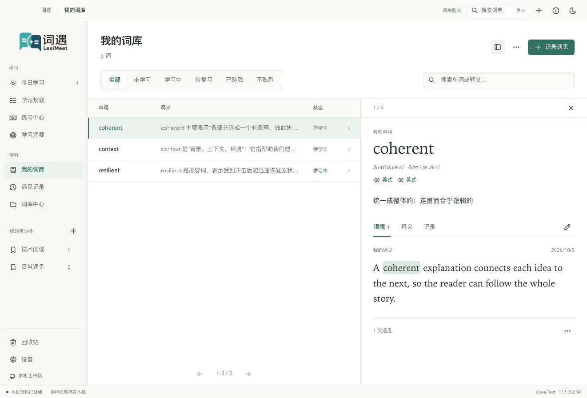
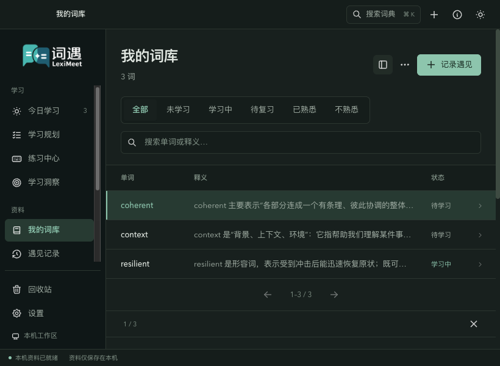
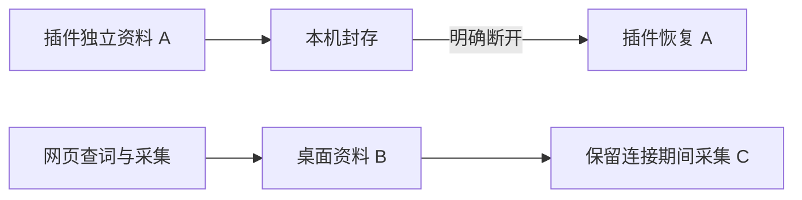

<div align="center">
  
  <h1>词遇 · LexiMeet Desktop</h1>
  <p>在语境里遇见，在记忆里重逢。</p>
  <p>
    <a href="docs/README.md">文档</a> ·
    <a href="docs/本地测试启动.md">快速启动</a> ·
    <a href="docs/插件连接.md">连接插件</a> ·
    <a href="CONTRIBUTING.md">参与贡献</a>
  </p>
  <p> </p>
</div>

词遇是本地优先的单词学习工作区。你可以保存阅读时遇见的真实语境，整理自己的词库，用六种练习积累熟悉度。连接浏览器插件后，网页查词和采集会使用桌面资料。

[跟随截图完成一次使用](docs/操作演示.md)：设置目标、手动采集、保存笔记、多词本整理与六种练习。

**1.0.0 为本地正式版本，远端发布尚未执行。** 使用时无需账号；云登录与独立设备同步计划在 2.0.0 实现。目前实际验证的平台是 macOS arm64，其他平台的构建配置不能代表验收完成。



<details>
<summary>查看黑暗主题与窄窗口</summary>



</details>

## 快速体验

完整检出需要 Core 子模块。在仓库根目录执行：

```bash
git submodule update --init core-java
bash scripts/test-desktop.sh
```

脚本会选择或准备 Node.js 24+、JDK 21、Maven 3.9，校验固定依赖与 Dictionary 0.0.3，然后启动隔离应用。默认每次创建空白 UUID 空间，不使用日常资料。首次准备需要网络，下载工具不会修改系统 Java。新装后可先选择进入或跳过教学。

```bash
bash scripts/test-desktop.sh --check       # 只读环境检查
bash scripts/test-desktop.sh --resume <ID> # 继续同一测试资料
bash scripts/test-desktop.sh --connected  # 同时拉起隔离 Desktop 和 Browser
bash scripts/test-background.sh           # 隐藏、静音、不占用键鼠的自动测试
```

同时启动两端需要相邻的 `plugin/leximeet-browser` 仓库。源码来源与目录布局、工具准备、退出时的清理和通知权限见[本地测试启动](docs/本地测试启动.md)。`npm start` 使用正式本机资料，不作为验收入口。

## 能做什么

准备安装文件：设置 JDK 21，提交 Desktop/Core 后运行 `npm run release:local`。它在本地生成版本隔离的安装包并执行隐藏的隔离安装验证，不发布远端内容。输出目录、源码对应、签名与启动排障见[本地打包与安装](docs/本地打包与安装.md)。

| 功能       | 体验                                                                    |
| ---------- | ----------------------------------------------------------------------- |
| 离线词典   | 内置 Core Text 117,902 词，增量补到 Full Text 811,092 词；23 个主题词库 |
| 学习规划   | 可选目标与每日安排，两步保存；默认新学 10 / 复习 20                     |
| 练习与复习 | 列表、看词选义、临摹、默写、听音辨词、语境填空；积分与 FSRS 分工        |
| 个人资料   | 笔记、多单词本归类、遇见语境与回收站；状态/词性筛选、批量整理、停靠词卡 |
| 系统提醒   | 时间范围内平均 30 分钟随机提醒，单次快速练习；默认看词选义              |
| 安全采集   | 剪贴板匹配目标、插件与手动额外采集；默认脱敏、句子限长、七天去重        |
| 本机连接   | 双端发现、确认配对、网页读取/采集、断开恢复独立资料                     |
| 发音       | 有道、Edge 兼容服务、自定义音频 API；设备密钥隔离                       |

新词从 10 分开始，首次达到 20 分完成初学，达到 30 分进入熟悉休息期。默写/填空正确 +2，其余模式正确 +1，错误或揭示答案 −1，最低为 0。完整调度与衰减规则见[学习与复习](docs/学习与复习.md)。

## 连接时的数据

<!-- leximeet-diagram: figure-b335630551-01 -->
<picture>
  <source media="(prefers-color-scheme: dark)" srcset="docs/diagrams/rendered/figure-b335630551-01.dark.svg">
  
</picture>

<details>
<summary>查看和编辑 Mermaid 源码</summary>

[图源文件](docs/diagrams/figure-b335630551-01.mmd)



</details>
<!-- /leximeet-diagram -->

连接时不会合并两端的独立资料。临时失联后，插件仍使用桌面作为资料来源；明确断开才恢复插件原资料，桌面保留 B+C。插件的管理和学习入口会引导用户前往桌面。参见[插件连接](docs/插件连接.md)。

## 开发与质量

[架构设计](docs/架构设计.md)解释 Renderer、Main、Core 与 Native Host 的分工，[功能设计](docs/功能设计.md)通过规划、练习、采集、提醒和失败恢复讲清完整行为。[开发指南](docs/开发指南.md)介绍固定资源与扩展点；[测试与 CI](docs/测试与CI.md)说明单元、真实进程、原生 UI、七天使用和打包链路的边界。

```bash
npm run format:check
npm run docs:check
bash scripts/test-desktop.sh --journey
```

贡献前请阅读 [CONTRIBUTING](CONTRIBUTING.md)，安全问题使用 [SECURITY](SECURITY.md) 中的私密渠道。跨平台、云同步和其他插件见[发布与路线图](docs/发布与路线图.md)。

## 许可与致谢

代码采用 [AGPL-3.0-only](LICENSE)。分发二进制须附对应源码和第三方许可，详见[安全与许可](docs/安全与许可.md)。

感谢 [leximeet-dictionary](https://github.com/leximeet/leximeet-dictionary)、[Qwerty Learner](https://github.com/RealKai42/qwerty-learner)、[Aictionary](https://github.com/ahpxex/Aictionary)、[pot-desktop](https://github.com/pot-app/pot-desktop)、[Maccy](https://github.com/p0deje/Maccy)、[Electron](https://github.com/electron/electron)、[Vue](https://github.com/vuejs/core) 和 [OpenJDK](https://openjdk.org/)。参考交互与实现思路不表示复制全部能力；实际资源来源和许可以随包 notice 为准。
