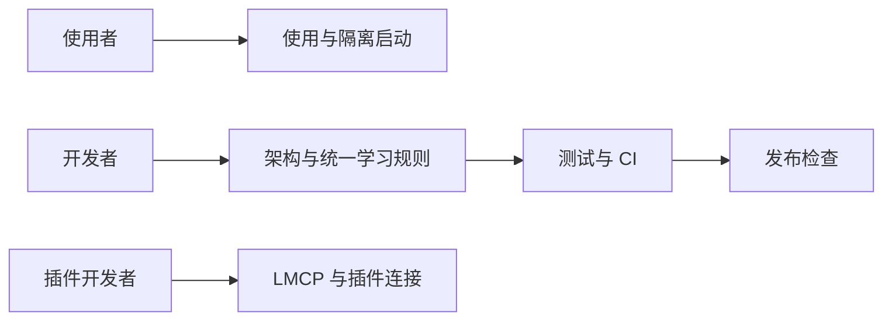

# Desktop 文档

这组文档以 1.0.0 的实现为准。应用、Core、LMCP、Dictionary 与个人数据库各自维护版本，不能根据页面版本判断数据或协议格式。

| 你想做什么                  | 阅读                                        |
| --------------------------- | ------------------------------------------- |
| 开始使用与常见问题          | [使用指南](使用指南.md)                     |
| 跟随步骤完成一次完整使用    | [操作演示](操作演示.md)                     |
| 一键启动隔离环境            | [本地测试启动](本地测试启动.md)             |
| 生成与验收本机安装包        | [本地打包与安装](本地打包与安装.md)         |
| 理解积分、状态、FSRS 和提醒 | [学习与复习](学习与复习.md)                 |
| 了解剪贴板、插件和手动采集  | [采集与隐私](采集与隐私.md)                 |
| 连接浏览器插件              | [插件连接](插件连接.md)                     |
| 词典安装、升级、发音配置    | [词典与发音](词典与发音.md)                 |
| 了解模块、调用和事务边界    | [架构设计](架构设计.md)                     |
| 了解完整功能和失败恢复      | [功能设计](功能设计.md)                     |
| 阅读代码与数据关系          | [架构与数据模型](架构与数据模型.md)         |
| 开发、扩展与规范            | [开发指南](开发指南.md)                     |
| 测试覆盖、CI 与证据边界     | [测试与CI](测试与CI.md)                     |
| 首装、七天使用、候选升级    | [日常使用与升级测试](日常使用与升级测试.md) |
| 界面、教学和可访问性        | [界面与交互](界面与交互.md)                 |
| 安全、依赖、许可与对应源码  | [安全与许可](安全与许可.md)                 |
| 核对依赖、旧源码与安装物    | [依赖与源码范围](依赖与源码范围.md)         |
| 发布检查和后续工作          | [发布与路线图](发布与路线图.md)             |
| 本次文档与仓库维护变更      | [维护记录](维护记录.md)                     |

<!-- leximeet-diagram: figure-0b5ca119d2-01 -->
<picture>
  <source media="(prefers-color-scheme: dark)" srcset="diagrams/rendered/figure-0b5ca119d2-01.dark.svg">
  
</picture>

查看和编辑 Mermaid 源码

[图源文件](diagrams/figure-0b5ca119d2-01.mmd)

<!-- /leximeet-diagram -->

Core 的[统一学习规则](../core-java/docs/统一学习规则.md)和[采集政策](../core-java/docs/采集安全与重复语境.md)定义可复用的业务行为；`resources/lmcp` 是固定的规范快照。本文档不需要工作区之外的开发记录或原型才能使用。

- [词库与学习预测](词库与学习预测.md)：目标引用、回收、多选、多词本、词性筛选与额度曲线。

- [1.0.0 发行说明](版本/1.0.0.md)：正式下载、macOS arm64 安装、源码与签名边界。
