# 使用指南

词遇把阅读时遇见的单词和句子保存在本机，再用六种练习巩固记忆。你可以设置学习规划，也可以只把它当作单词本。1.0.0 支持连接本机浏览器；账号与云同步列入后续计划。

第一次操作可以按[桌面端操作演示](操作演示.md)逐步完成，包含完整窗口截图、各方式的作答动作和保存后的检查位置。

<!-- leximeet-diagram: figure-ab5a8522bb-01 -->
<picture>
  <source media="(prefers-color-scheme: dark)" srcset="diagrams/rendered/figure-ab5a8522bb-01.dark.svg">
  
</picture>

查看和编辑 Mermaid 源码

[图源文件](diagrams/figure-ab5a8522bb-01.mmd)

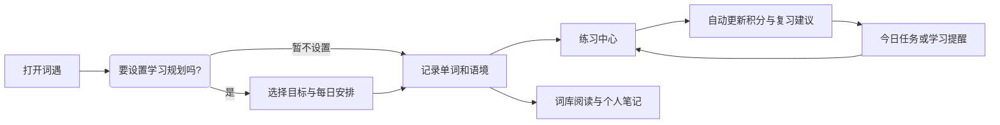

<!-- /leximeet-diagram -->

本页界面来自实际 Electron 应用和 Java Core，使用隔离资料与公开合成句子。手动遇见窗口和系统通知是两个入口；通知的样式、权限与动作由操作系统管理。

## 第一次打开

首次打开先出现邀请，选择「进入教学」或「跳过教学」。教学可在「设置 → 使用教学」重新开始；支持上一步、拖动讲解卡和跳过。跳过不会创建学习目标或练习记录。

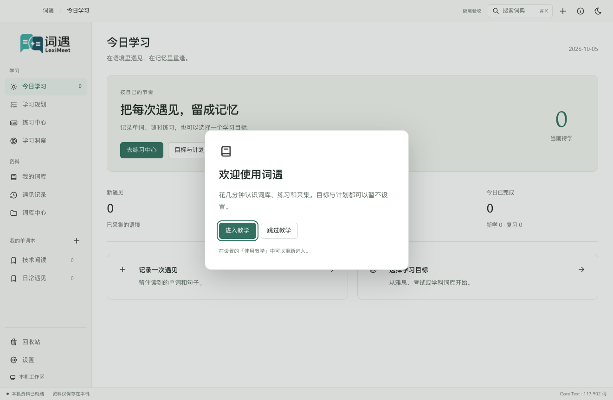

侧边栏上方是今日学习、学习规划、练习中心和学习洞察；下方是词库、遇见记录和词库中心。单词本、回收站与设置分别有固定入口。顶部的搜索查询整个本地词典，快捷键为 macOS `⌘ K`、Windows / Linux `Ctrl K`。

## 选择目标，再安排每天的学习

打开「学习规划 → 设置学习规划」。第一步选择主题词库，支持考试、专业分类和搜索；也可以选择整本本地词典。这里选择的是草稿，最终保存前不会替换现有规划。

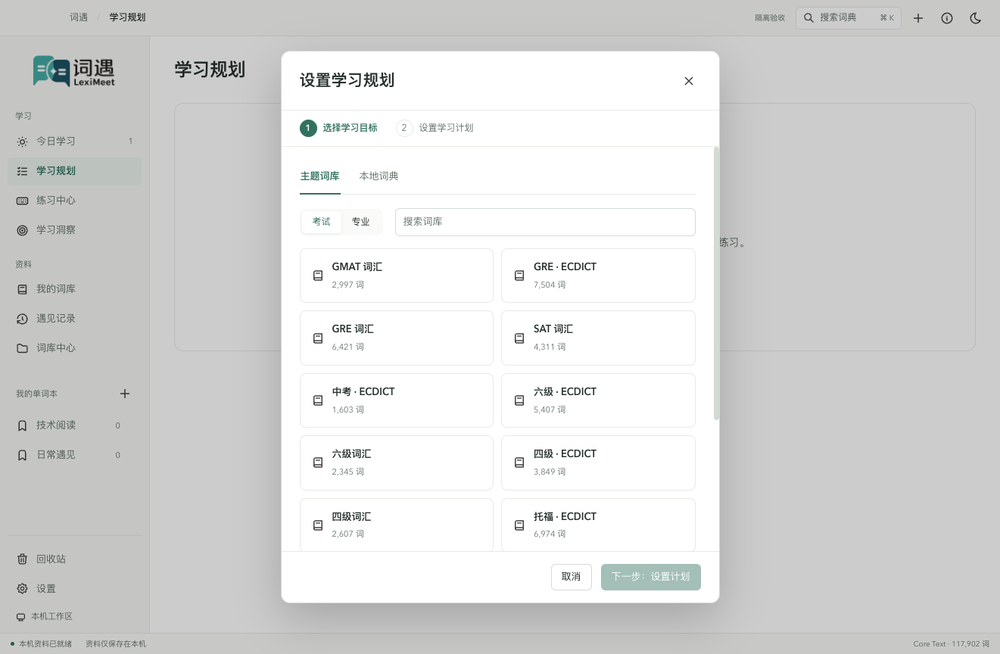

点击「下一步」，设置每天新学和复习，默认 **10 / 20**。开启学习提醒后设置时间范围，默认 **08:00–20:00**；关闭提醒会收起时间输入。确认「保存学习规划」后才同时保存目标与计划。

切换步骤会回到内容顶部；点击「上一步」可重新选目标，已经填写的每日安排仍保留。

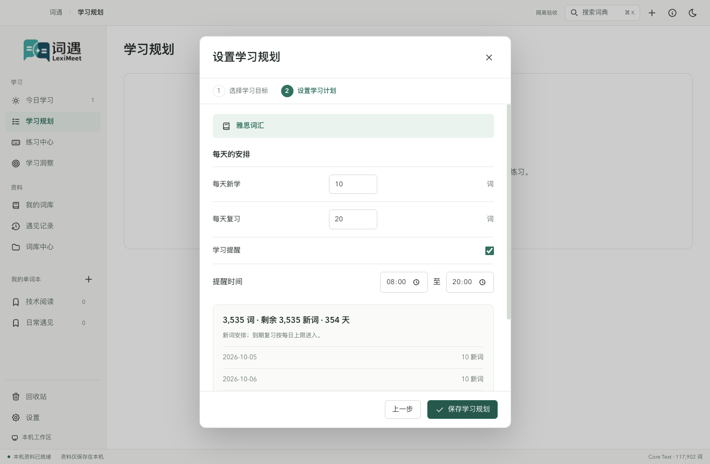

计划中的数量是建议量，主动练习可以超出它。在「设置 → 学习提醒」选择通知中的练习方式，默认看词选义；应用在后台时，会在时间范围内约每 30 分钟随机提醒一次。应用在前台、没有可用任务或系统不能通知时，不会为了凑次数连续发题。

不需要计划时，直接使用词库与自由练习即可。更换目标保留已存的笔记、遇见和学习经历；关闭计划不会删除资料。

## 记录一个单词和它所在的句子

### 手动记录

在「遇见记录」点击「记录新的遇见」，或使用顶部的加号，打开独立遇见窗口。填入单词和包含它的句子，来源标题与网址可选。公共释义由本地词典提供，个人理解可在词卡中保存为笔记。

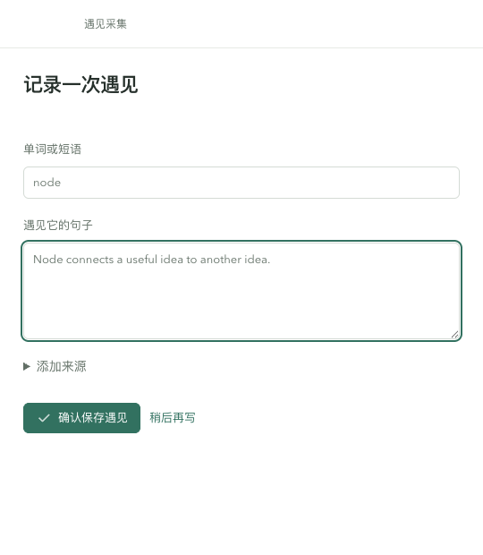

点击「确认保存遇见」后，窗口关闭，记录进入桌面资料。「稍后再写」退出当前窗口；不要把尚未确认的输入当成已保存内容。

### 剪贴板识别

到「设置 → 采集与快捷键」开启识别。它只处理**当前学习目标内**的英文单词；没有目标时保持安静。复制多句文本时，每个目标词保存它所在的安全句子，不把整段内容都存成语境。

默认通过系统通知询问采集，10 秒后自动采集；可设置到时不采集，也可以明确选择独立弹窗。不要把手动遇见窗口误认为默认通知。系统通知需词遇的系统权限，未送达不会自动改用弹窗。

### 浏览器连接时

浏览器侧栏和悬浮球可以采集学习目标之外的单词。连接后，采集会直接写入桌面资料，成功时桌面默认发送通知；可在采集设置中关闭这个成功通知。连接与断开步骤见[插件连接](插件连接.md)，插件的独立资料在连接期间封存，断开后恢复。

三种采集入口都遵守脱敏、长度与重复规则。默认同词同句七天内不重复保存，`Node ...` 与 `node ...` 的大小写变化不产生另一条遇见；不同句子仍可保存。查重不会改写原句和位置，分数也不会因为采集而上涨。详情见[采集与隐私](采集与隐私.md)。

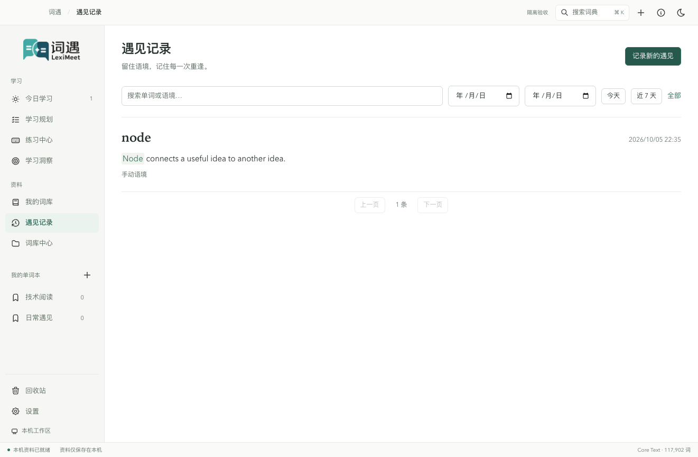

## 在词库里阅读、记笔记和整理

「我的词库」提供全部、未学习、学习中、待复习、已熟悉、不熟悉筛选，以及单词和释义搜索。选择一行，右侧词卡展示发音、语境、完整释义和个人记录；宽窗中两边各自滚动，窄窗中词卡排到列表下方。

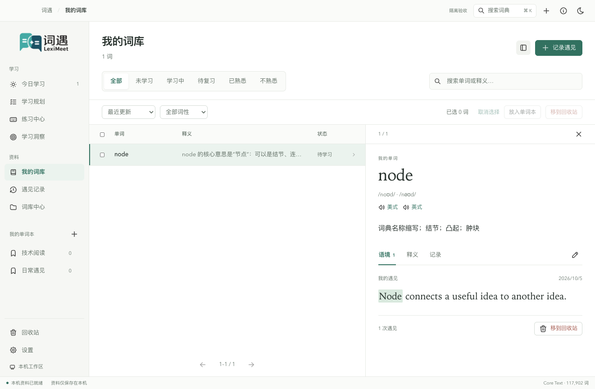

「语境」优先显示真实遇见；「释义」阅读词典正文；「记录」查看学习信息、笔记和归类。点铅笔进入编辑，保存后才更新资料。未保存草稿在当前窗口切页时保留；退出前请保存需要的内容。版本冲突时保留输入并要求刷新，不用重复点击绕过它。

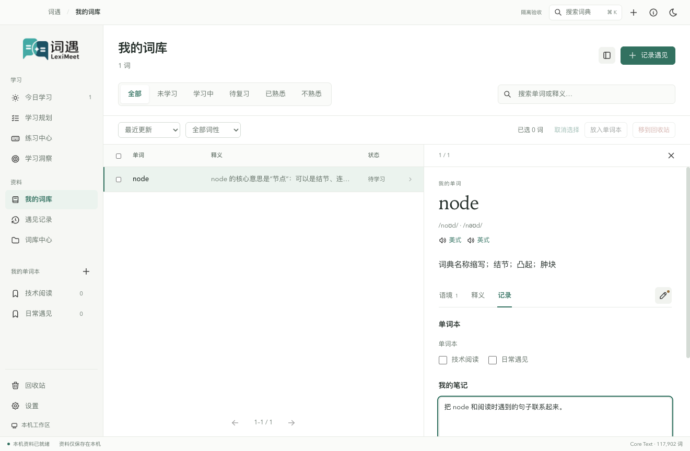

单词可以加入多个单词本。移入回收站是个人资料操作，公共词典仍可查询；在回收站可恢复资料。学习状态由实际练习和经历计算，不能用编辑笔记直接标成已掌握。

## 六种练习怎样使用

在练习中心选择「我的词库」「当前学习目标」「今日任务」「整本词典」或一个单词本。六种方式共用学习规则，但各自保留位置与输入，切换后回到该方式上次练到的词。

| 方式     | 操作                                                             | 正确反馈                               |
| -------- | ---------------------------------------------------------------- | -------------------------------------- |
| 单词列表 | 默认遮挡中文，可切换遮挡英文；回想后选「熟练 +1」或「不熟悉 −1」 | 没有标准正误；查看遮挡答案按不熟悉处理 |
| 看词选义 | 回想词义，再选择一个选项                                         | +1                                     |
| 单词临摹 | 按淡色幽灵字母输入；已输入部分清晰显示                           | +1；不冒充独立回忆                     |
| 单词默写 | 看释义输入英文，没有未输入字母提示                               | +2                                     |
| 听音辨词 | 听发音后输入英文                                                 | +1                                     |
| 语境填空 | 根据句子空缺输入英文                                             | +2                                     |

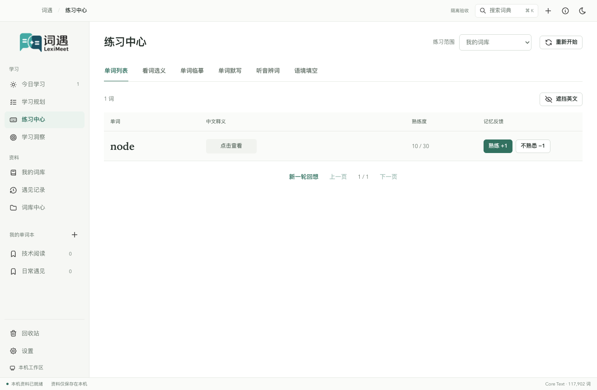

正常点击后选项保持着色，固定状态行显示保存进度；只有真实错误或未知结果才显示重试。正确并确认保存后，结果**至少停留一秒**再自动进入下一词；听音辨词会等当前发音结束，播放失败也可继续；错误保留原题，可以订正。同题首次反馈计分，连续点击、重复 Enter、查看提示后订正都不会制造额外积分。关闭「练习设置 → 自动进入下一词」后，点击「熟记」手动继续。

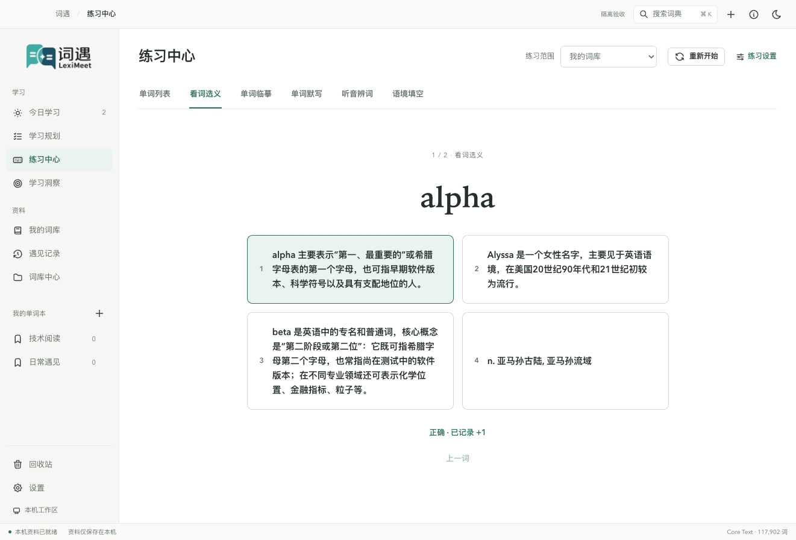

临摹的幽灵文字仅提示尚未输入部分，正确输入清晰着色，错误位置单独提示。退格、方向键、选择和输入法使用真实输入框，不截获其他应用的键盘。

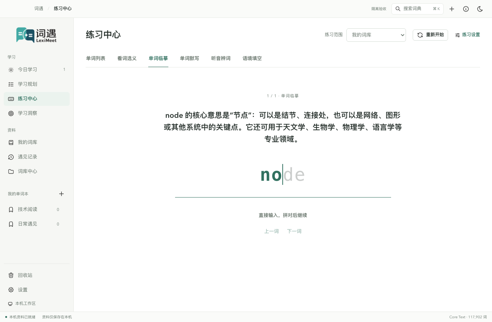

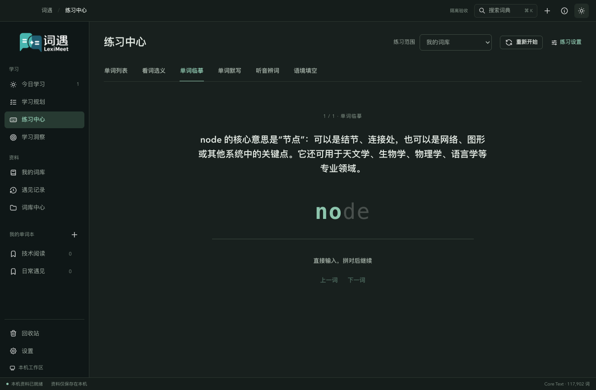

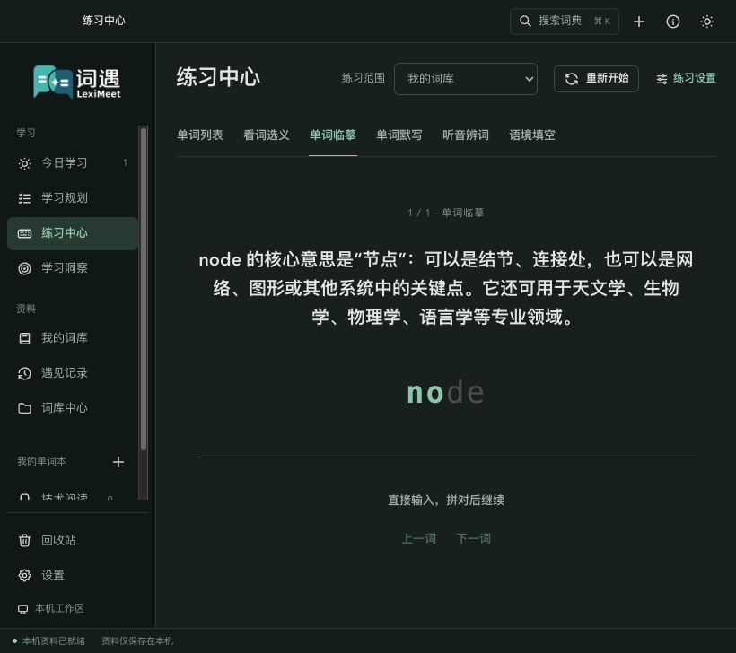

点击「重新开始」会保持范围和方式，从第一词开始新一轮，清空当前模式的输入和答案揭示状态，并刷新该模式的词范围；其他模式的进度、已经保存的积分与记录仍保留。切换、重开或离开页面会取消旧题的自动推进。如果提示「结果尚未确认」，先点「重试保存」恢复原事件，不能用重开绕过它。

<!-- leximeet-diagram: figure-ab5a8522bb-02 -->
<picture>
  <source media="(prefers-color-scheme: dark)" srcset="diagrams/rendered/figure-ab5a8522bb-02.dark.svg">
  
</picture>

查看和编辑 Mermaid 源码

[图源文件](diagrams/figure-ab5a8522bb-02.mmd)

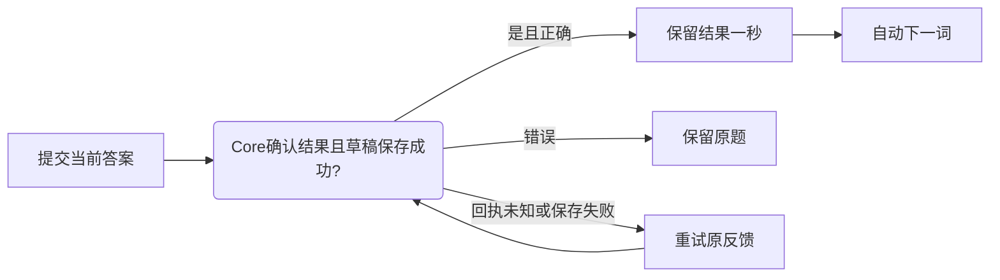

<!-- /leximeet-diagram -->

积分初始 10、最低 0；达到 20 完成初学，达到 30 进入熟悉休息期。FSRS 决定自动复习建议，主动练习仍可继续。完整状态、衰减和每日完成量见[学习与复习](学习与复习.md)。

## 遇到问题

- **没有题目**：先记录单词，或把范围换成词典。没有真实释义或有效语境时，该模式会明确不可用，可换方式或下一词。
- **正在保存或回执未知**：使用原题的恢复入口；确认前不能重开丢弃原事件。
- **没有通知**：检查系统权限、计划与提醒开关、时间范围和当前任务。剪贴板还需要目标内匹配。
- **插件临时失联**：恢复桌面应用或明确断开。失联时不会偷偷把写入改投到插件独立库。
- **要测试一次新装**：使用[隔离启动脚本](本地测试启动.md)，不要删除正式个人数据库。

文本词典可离线使用。默认发音服务只请求单词，API 配置见[词典与发音](词典与发音.md)。

## 批量整理和查看预测

词库列表上方可按最近更新、字母或词书顺序排列，并与词性、状态及搜索组合。勾选当前页多个词后，可以加入多个单词本；「移到回收站」需要再次确认。回收站可批量恢复。编辑只包含「我的笔记」和多选单词本。

学习规划概览显示初学完成数量曲线与近期的具体词表。切换日期可查看当天的候选，切换区间可查看 7 天至整个计划按额度推算的安排。这些预测不代表成绩或已熟悉的词数。操作截图、前后对照和具体规则见[词库与学习预测](词库与学习预测.md)。

听音、默写或填空点提示后，会出现淡色幽灵字母；原来的输入不被覆盖，可以继续打字或退格订正。
