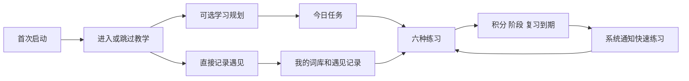
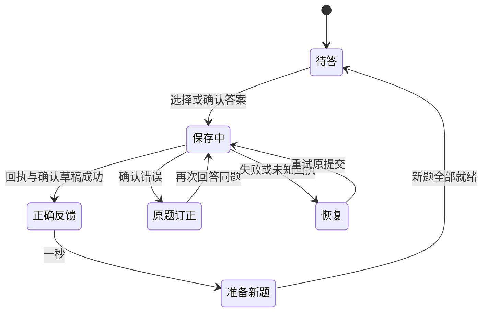
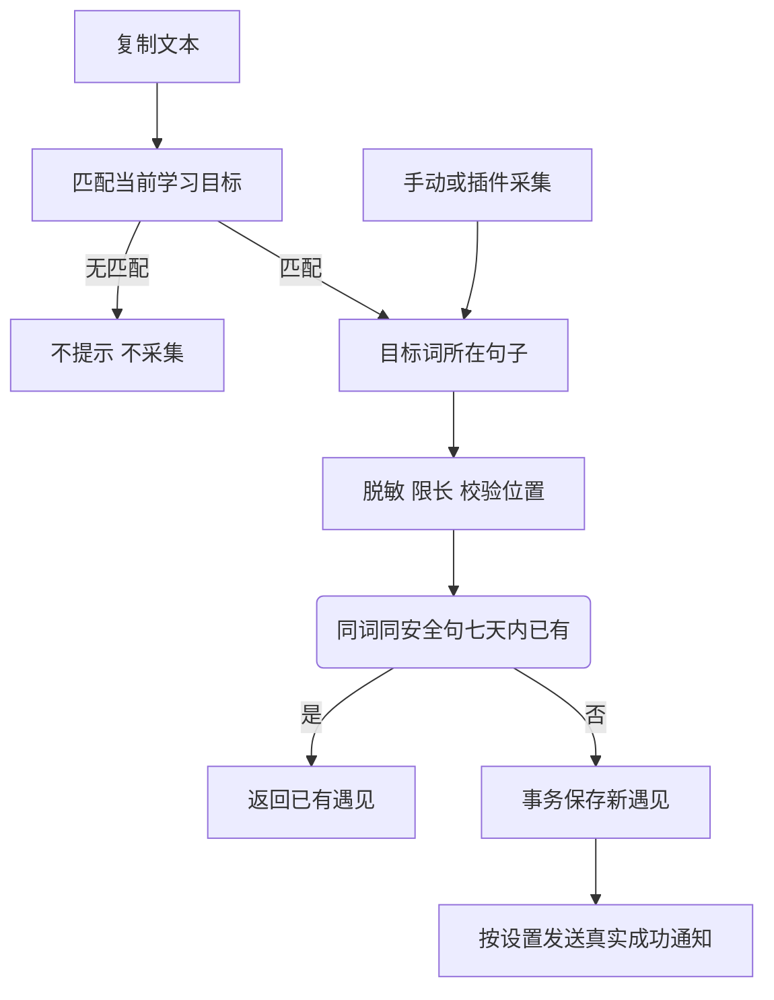

# Desktop 功能设计

本文说明当前功能如何工作、数据的保存边界，以及失败后如何处理，供开发者修改桌面端或了解它与连接插件的协作。实际操作与截图见 [使用指南](使用指南.md)，权威学习与数据规则见 [Core 功能设计](../core-java/docs/功能设计.md)。

## 功能地图

<!-- leximeet-diagram: figure-93a1929f6a-01 -->
<picture>
  <source media="(prefers-color-scheme: dark)" srcset="diagrams/rendered/figure-93a1929f6a-01.dark.svg">
  
</picture>

查看和编辑 Mermaid 源码

[图源文件](diagrams/figure-93a1929f6a-01.mmd)

<!-- /leximeet-diagram -->

用户可以把应用当成空单词本，不选择目标，也不启用计划。目标、计划、提醒是可选能力，不能成为普通记录和主动练习的门槛。

## 1. 首次启动与教学

启动先显示进入/跳过教学邀请。教学先介绍侧边栏，再带用户选择可选目标与计划、体验练习和剪贴板采集，最后参观必要设置。提供“上一步”“下一步”“跳过”，设置中可以重新进入。

教学强调真实结果：练习保存成功、发音播放自然结束等才推进操作步骤。演示设置时，主要通过卡片中的下一步确认，不要求用户实际修改偏好；参观回收站也不要求删除单词。笔记、创建词本和遇见表单不强制加入教学。

`guide-steps.js` 定义步骤，`OnboardingGuide.vue` 根据真实元素位置安排卡片、高亮与允许操作范围；目标不存在时使用明确空态或恢复入口，不把上一页的高亮留在当前页。教学引导练习关闭自动下一词，用户完成当前操作后按教学步骤推进。

## 2. 学习规划等于目标加计划

`PlanPage.vue` 展示当前目标、进度和每日计划；`PlanDialog.vue` 使用两步编辑。

| 步骤     | 用户操作                           | 默认/边界                                  | 保存             |
| -------- | ---------------------------------- | ------------------------------------------ | ---------------- |
| 选择目标 | 搜索并选择公共词书或整本本地词典   | 无当前目标时优先雅思候选，也可选择其他目标 | 暂不写个人资料   |
| 设置计划 | 每天新学、复习、提醒开关与时间范围 | 新学 10、复习 20、08:00–20:00              | 一次命令原子保存 |
| 查看预览 | 看剩余新词和最近日期               | 估计新学完成安排，不承诺实际学习效果       | 只读查询         |

点击下一步会回到表单顶部，返回时保留输入，取消时不写入资料。关闭学习提醒后隐藏时间范围。提醒题型在设置中选择，规划不展示频率和复杂通知参数。每日实际使用量根据 Core 的有效学习事实计算，修改计划不会清空今天的已完成量。

规划编辑携带 expectedRevision；其他窗口或连接操作改变版本时保留草稿并显示冲突，不覆盖较新的目标。目标替换不删除旧词笔记、语境或成绩。

## 3. 今日学习和主动练习

今日页展示目标、新学与到期复习数量，并提供进入练习中心的入口。任务队列由目标、计划、资格、FSRS 和额度投影共同决定；没有今日任务时，仍可从个人词库主动练习。

练习范围包括我的词库、当前目标、今日任务、整本词典和具体词本。更改范围先保存可保存的草稿再确认切换。“重新开始”从当前范围第一词开新一轮，保留分数、笔记和遇见；未确认反馈须先恢复，避免丢掉原提交身份。

## 4. 六种练习的交互

| 模式     | 页面交互                                          | 结果                          |
| -------- | ------------------------------------------------- | ----------------------------- |
| 单词列表 | 默认遮挡中文，可一键遮挡英文；熟练 +1 / 不熟悉 −1 | 回忆信号计分，揭示练习答案 −1 |
| 看词选义 | 看英文，点击一条冻结中文释义                      | 正确 +1，错误 −1              |
| 单词临摹 | 看弱幽灵字母输入，正确部分清晰                    | 拼写正确自动确认，+1          |
| 单词默写 | 根据中文独立输入                                  | 拼写正确自动确认，+2          |
| 听音辨词 | 听发音后输入，可再听                              | 确认真实答案，正确 +1         |
| 语境填空 | 在真实句子里补目标词                              | 确认真实答案，正确 +2         |

普通阅读词卡不会扣分，练习中的“提示/揭示”才属于辅助行为。同题只采用首次有效反馈计分，错误后订正或看提示后输入正确不再补分。当前不可用模式显示当前词及原因，允许换方式/下一词，不能显示上一题的释义。

### 选择、保存、换题是一条连续动作

点击后先保持选中背景，锁定同题输入，在固定高度状态行显示“正在保存”。Core 回执与提交 ID 匹配，且确认草稿保存成功后才显示“正确 · 已记录”。正确结果至少停留 **一秒** 后自动进入下一题。听音辨词还会等待当前题的发音自然结束，以及播放完成回执；失败或停止播放不阻塞继续。异常播放最多额外等待 30 秒，防止永久卡住。

<!-- leximeet-diagram: figure-93a1929f6a-02 -->
<picture>
  <source media="(prefers-color-scheme: dark)" srcset="diagrams/rendered/figure-93a1929f6a-02.dark.svg">
  
</picture>

查看和编辑 Mermaid 源码

[图源文件](diagrams/figure-93a1929f6a-02.mmd)

<!-- /leximeet-diagram -->

等待过程不插入红色“尚未确认”条，因此正常点击不会将题卡推下再拉回。错误留在原题；连续点击和 Enter 不跳过反馈。换题期间保留上一题全部内容，新词、选项、草稿和题目都准备好后一次替换。

可以关闭“自动进入下一词”，之后用“熟记”继续。重复次数用于在同一道题内练习输入，订正和多次复制不会无限增加积分。切换模式、重开、离开页面或改变范围时，会取消旧计时器。

### 真实失败怎么恢复

Core 不可用、回执缺失或确认草稿失败时，保留当前题、已选答案及原提交 ID。恢复入口只在操作已经结束时出现；用户重启核心后按“重试保存”，恢复原回执再继续。未确认期间不能改选另一个答案，也不能用重新开始跳过待确认事件。

看词选义的候选优先从本轮实际练习范围中选择，不足时再从公共词典中有界采样。每题的目标释义、选项和正确答案一起冻结，不会因为详情刷新或重启而改变。

## 5. 状态筛选和复习

列表支持全部、未学习、学习中、待复习、已熟悉、不熟悉。初始 10 分表示尚未观察到练习结果，不能直接称为不熟悉。首次达到 20 保留初学完成经历；自动复习最早次日。满分 30 有完整保护期，再按时间衰减到 20 才重新获得自动复习资格。

不熟悉是 0 分程度标记，可和学习中/待复习经历共存。FSRS 计算到期，积分描述进度；只有资格与到期条件都符合、每日复习仍有额度时，才进入自动队列。完整值和例子见 [学习与复习](学习与复习.md)，不在 UI 另写一套算法。

`LibraryPage.vue` 的搜索、状态、计数和分页共同使用 Core 查询。`WordCard.vue` 展示语境、释义和记录，个人内容编辑保护脏草稿并检测修订冲突。

## 6. 三种采集入口

| 入口                | 目的                 | 提醒/编辑                          | 保存规则                     |
| ------------------- | -------------------- | ---------------------------------- | ---------------------------- |
| 剪贴板              | 目标词的真实语境     | 只匹配目标英语词，默认逐词系统通知 | 只保存匹配词所在安全句子     |
| 浏览器连接插件      | 目标内外词与网页语境 | 悬浮球、侧栏和网页操作             | 桌面 Core 权威保存并返回回执 |
| 手动/遇见采集快捷键 | 主动记录额外词和语境 | 独立采集编辑器                     | 用户确认后调用同一采集政策   |

剪贴板默认 10 秒后按采集偏好处理，也可设默认不采集；系统通知和独立弹窗提醒可切换，默认系统通知。OS 通知未展示时不能启动“已提醒”倒计时或悄悄采集。

<!-- leximeet-diagram: figure-93a1929f6a-03 -->
<picture>
  <source media="(prefers-color-scheme: dark)" srcset="diagrams/rendered/figure-93a1929f6a-03.dark.svg">
  
</picture>

查看和编辑 Mermaid 源码

[图源文件](diagrams/figure-93a1929f6a-03.mmd)

<!-- /leximeet-diagram -->

默认脱敏开启、最多 500 UTF-16 单元、滚动七天重复窗口。安全句的归一键忽略大小写和多余空白，原句显示不变；不同真实句子继续保留。重复不新增遇见、笔记、关系、修订或成功通知。

插件成功通知默认开启，设置可关闭。通知来自实际 Core 成功回执，并按原回执去重，不能用点击采集按钮的次数当作成功次数。

## 7. 词库、遇见与个人内容

我的词库按当前目标和个人活动词查询；词库中心管理公共资源与主题，不把全部公共词复制成私人行。遇见记录显示单词、较小的语境文字、来源和时间，并支持关键词/日期过滤。

当前个人编辑只支持笔记和多词本归类，不修改公共释义，也没有自定义标签入口。省略冻结数据字段时保留原值，不在 UI 保存时隐式清空。保存携带 expectedRevision，冲突时保留输入。回收使用可恢复的删除标记；连接采集不会自动恢复被回收的词。公开词典或安全原文按允许的 Markdown 结构显示，不执行 HTML。

## 8. 系统通知快速练习

提醒要求启用计划与提醒，位于时间范围内，有合格任务，且符合 Main 节流。提醒间隔随机 25–35 分钟，平均 30 分钟；休眠错过不集中补发。题型在设置选择，可多种轮换，默认看词选义。

通知展示一个冻结题。用户实际答题才进入同一 Core 判题与积分事务；显示、忽略、关闭通知均零学习事件。当前 macOS 实际投递还取决于系统通知权限；测试适配器能验证队列行为，不能证明用户电脑一定展示通知。

## 9. 插件连接的产品行为

本机发现只提示可连接；点击后在插件所属界面确认，双方自动生成连接与认证材料，无需手工复制代码。成功后插件管理功能提示前往桌面，网页阅读/采集直接使用桌面资料；双方都可明确断开。

插件独立资料 A 在连接期间封存，桌面 B 不改变原有内容；连接采集 C 保存为 B+C。断开恢复 A，C 仍留桌面。短暂断网不改回独立资料，不发生混写；撤权与普通断开分别处理。详见 [插件连接](插件连接.md)。

## 10. 设置、测试与版本边界

设备设置包括主题、发音、练习声音、提醒题型、采集政策、连接、通知与教学入口。当前主要功能可离线使用；在线发音提供者需要联网。尚未实现的翻译、账号、云同步、商店/签名等能力保留在路线图中，不能仅凭可见按钮宣称已完成。

功能改动必须覆盖真实操作与失败恢复。纯单元验证定时器、幂等与并发；隐藏原生 UI 验证完整输入、快速选择、布局、实际 Core 故障恢复；连接套件验证桌面有对应数据和插件 A 不变。结果与范围见 [测试与 CI](测试与CI.md)，开发入口见 [开发指南](开发指南.md)。

## 词库和预测的边界

我的词库是目标公共词引用与主动收录的并集，再排除个人回收标记。目标词也能回收、恢复；批量操作限定当前页且由 Core 原子处理。词性来自真实词典派生索引，排序筛选先于分页。学习预测只推算初学完成额度，今日词采用真实任务队列，未来候选有界，不产生词条或学习事实。参见[词库与学习预测](词库与学习预测.md)。
