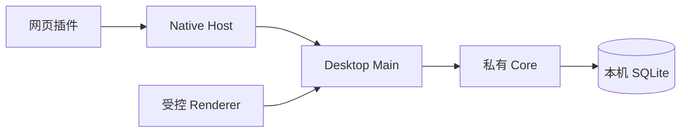

# 安全与许可

## 边界

Renderer 通过受控 IPC 请求 Main；Main 持有本机 Core 凭据与网络/系统能力。Core 私有回环 HTTP 不面向浏览器直接开放。插件通过 Native Messaging Host 和同用户本机通道连接，按来源、权限、连接代次、请求身份和期限校验。

<!-- leximeet-diagram: figure-5c4f6fce1b-01 -->
<picture>
  <source media="(prefers-color-scheme: dark)" srcset="diagrams/rendered/figure-5c4f6fce1b-01.dark.svg">
  
</picture>

查看和编辑 Mermaid 源码

[图源文件](diagrams/figure-5c4f6fce1b-01.mmd)

<!-- /leximeet-diagram -->

自定义发音密钥由 safeStorage 加密保存，不返回 Renderer，不进入业务备份；没有安全加密能力时拒绝明文保存。网络默认不发送私人语境。未知数据库格式拒绝并保留。剪贴板忽略密码管理器隐私格式；脱敏仅覆盖明确规则，敏感个人内容仍需用户自行判断。

## 报告问题

不要在公开 Issue 放入令牌、个人数据库或未脱敏语境。请通过仓库 Security 提交私密漏洞报告（若已启用）；未启用时，先向维护者获取私密渠道，再提交复现材料。公开报告普通缺陷时，可附脱敏后的步骤、版本、系统与最小测试资料。项目不承诺固定响应时限。

## 许可与供应链

应用与 Core 使用 AGPL-3.0-only。随包的 Electron、Java 运行时、Native Host、公共词典与音效有各自许可，不能只附本项目 LICENSE。

| 物料                       | 发布时保留                                       |
| -------------------------- | ------------------------------------------------ |
| 应用与 Core                | LICENSE、同提交完整对应源码与构建方法            |
| Java / Electron / npm 依赖 | 随包 legal / LICENSES 与第三方声明，锁文件       |
| Dictionary 0.0.3           | DATA-LICENSE、各 notice、来源锁、固定清单与哈希  |
| 临摹键盘音                 | frontend/src/assets/audio/NOTICE.md 与原来源许可 |
| Core 运行依赖              | Jar 内许可证和 CycloneDX SBOM                    |

Core `sources.jar` 是辅助附件，不能单独替代含 pom、脚本、测试和文档的完整对应源码。正式二进制应附同一 Git 提交的源码归档、SHA-256 和明确的签名状态。候选包为本地 ad-hoc 签名，不代表 Developer ID 公证或商店发布。

应用的 `Resources/electron-licenses/` 保留当前 Electron 上游的原始 `LICENSE` 和 `LICENSES.chromium.html`；不把 Chromium 的依赖声明改写为本项目许可。随包检查逐字节比较这两份文件，并核对自有 ASAR 许可、Core Jar、公共词典原 notice、JRE legal 和 Native Host 物料。

Vue 的 runtime 虽在 `devDependencies` 中安装，编译后的运行代码仍属于生产前端。ASAR 的 `resources/licenses/Vue-MIT.txt` 保留原始完整许可，`FRONTEND-SOURCES.json` 固定各 runtime 包的版本与锁文件完整性值。随包检查逐字节核验该目录，不能以开发依赖分类省略这份通知。

`candidate.yml` 同时生成 `desktop-source.tar.gz` 和固定 gitlink 的 `core-source.tar.gz`，独立 `SOURCE_SHA256SUMS` 与 metadata 记录两仓提交。Desktop 归档包含 Native Host、前端、构建锁和脚本；Core 归档包含 pom、源码、测试、许可与文档。两份必须一同交付，不能用 GitHub 自动生成的 Desktop 单仓源码包代替 Core 正文。公共词典和随包运行时的固定来源与许可仍按各自声明保留。

源码使用方法：先解压 Desktop，再把 Core 的内容放入 `core-java`，按[开发指南](开发指南.md)安装锁定依赖和固定资源。`SOURCE_METADATA.json` 保存版本、规范摘要、源码哈希和构建入口；候选 metadata 从实际 `JAVA_HOME/release` 读取 JDK 补丁版本和供应商，CI 使用 Temurin。分发时须保留随包 `legal/`，核对该补丁版本的运行时源码/许可获取方式；仅写“Java 21”不够。

Actions 固定到完整提交 SHA，工作流默认为只读；依赖按 lock 与固定资源清单获取。构建结果、漏洞扫描和签名检查分别记录。检查历史内容时，不能只看当前树；截图还需复核实际画面。私密审计证据不放入公开仓库。

## 2026-10-05 依赖审计

已将 ws 更新至 8.22.0，serialize-javascript 至 7.1.2，并更新兼容范围内的 brace-expansion / fast-uri。`npm audit --omit=dev` 当前为 0 命中，覆盖随应用生产依赖，不代表不存在未知漏洞。

本轮全量审计仍有 **1 个高危开发依赖命中**，路径为 electron-builder → @electron/get → got → cacheable-request → http-cache-semantics。上游[公告](https://github.com/advisories/GHSA-ch52-4w7c-c8xp)仍未列出修复版本。npm 已发布兼容的 4.3.0，但核对原始包发现其变更为 Vary 匹配与状态码读取，未改变公告涉及的 max-stale 分支；公开合成响应复验中，4.2.0 和 4.3.0 均能用 max-stale 复用被置零的带 Set-Cookie 响应。仅升级出公告版本范围不能证明问题消失，因此本轮保留 4.2.0 和风险记录，未执行 `audit fix --force`，也未通过盲目升级消除扫描数字。

该链属于构建工具，不在生产依赖集合。当前锁定下载器默认不启用 HTTP 响应缓存；实际本机合成下载复验中，两次带 Set-Cookie 的响应均请求服务端，未复用缓存。现有打包使用已校验的本机 electronDist，CI 只读取公开固定物料，不把账号认证响应放进共享 HTTP 缓存；实际 ASAR 物料门禁同时拒绝该链的五个构建包进入运行包，包括嵌套与 unpacked 项。这些边界不代表上游漏洞已修复。以后启用响应缓存、账号 Cookie 或认证下载时须重新评估；正式发布仍需等待上游修复或验证替代工具链。构建机/缓存应专属并保持干净，不将“生产审计为 0”表述为“全量审计为 0”。

修复公告参考：[ws 内存与碎片处理](https://github.com/advisories/GHSA-96hv-2xvq-fx4p)、[serialize-javascript](https://github.com/advisories/GHSA-gfhx-hw2g-v5hg)。
