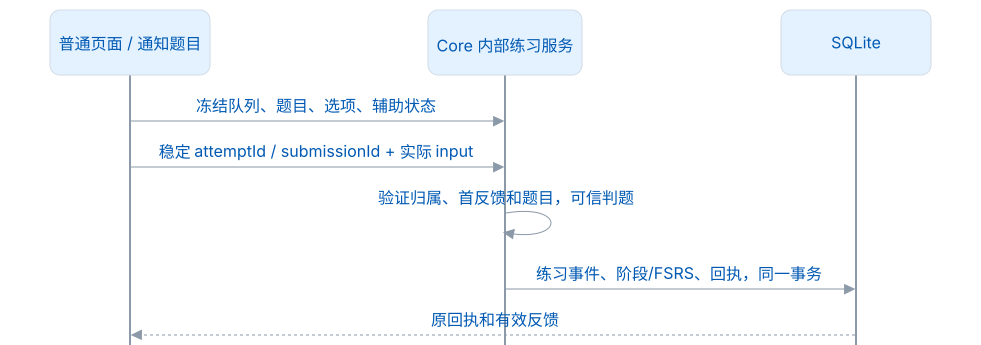
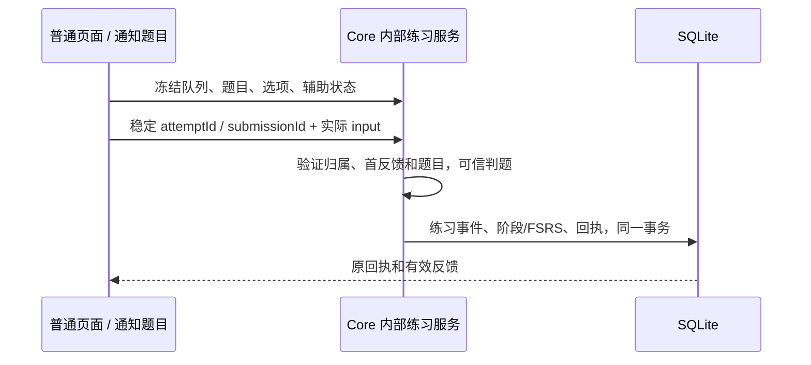

# 开发与跨端学习接入

## 插件采集结果通知与练习重开

`PluginCaptureNotifications` 消费 Gateway 的 `onCaptureCommitted`，只在真实 Core `recordEncounter` 任务成功完成后接收脱敏 DTO：`workspaceId`、`generation`、`eventId`、`word`、`pluginName`。调用点独立于 ACK 送达，通知失败不能改写采集的成功结果。未来插件适配器应复用这个入口，不能直接从点击或未确认写入触发通知。

Core 的 `pluginCaptureNotificationsEnabled` 为严格布尔设置，默认 `true`，快照与当前备份保存该值。Main 每次消费时读取已确认设置，按工作区＋代次＋事件 ID 去重；设备通知缓存只存近期回执哈希，原文、来源和凭据不进入缓存。`runtime.pluginCaptureNotifications.sentCount` 是本次进程收到通知 `show` 的数量，后台使用静默通知适配器验证触发链路，不等同于人工看到了 OS 横幅。

重开练习复用 `practice-session.restartRound()`；页面取消旧的输入计时和发音，保持范围与模式，并重新生成本轮题目身份。重开不会发送撤销学习命令，也不会清空学习资料。未确认的提交仍保留原 `submissionId`，页面提供「重试保存」，确认后才允许重开。practiceFeedback 的 onConfirmed 回调先清除待确认标记并持久化，再发布工作区/教学状态；教学切页时，不能将已提交成功的草稿保存为 pending。列表与提示也要在确认后先保存，再查询详情。不同模式/范围的列表待确认记录不合并。practiceQuestion 不适用时返回 unavailable/reason，页面显示新词与下一词入口，不保留上一题的正确画面。

确认草稿保存失败时，工作区继续刷新 Core 业务事实，但保留最后显示的教学步骤。原 submissionId 恢复并落盘后，教学才可继续；另一单词的成功反馈不能解除这个限制。用户明确选择跳过、回看或重置教学时，选择仍生效。

适用：Desktop 1.0.0、schema 100、LMCP 1.0.0。Desktop 本机学习规则仍为 leximeet.learning/2；LMSP、登录、云同步留到应用 2.0.0。

## 采集策略与业务时钟

三种采集入口都经 Core CapturePolicy，在同一事务中处理单词所在句、xxx 脱敏、UTF-16 长度/范围与默认七天去重。持久幂等仍校验原请求哈希；重复时返回已有遇见和 captureStatus=duplicate-context，不更新资料 revision，也不发送采集通知。剪贴板预查询带 text，Main 队列只保存 Core 返回的安全 context，事务保存时再次复核。Browser 连接后，getWorkspace.capturePolicy 采用桌面设置，不能用封存的独立设置覆盖桌面规则。设置、字段和边界见[采集说明](采集与隐私.md)。

FileBusinessClock/WorkspaceClock 是学习业务时间入口。仅显式 test profile 的测试时钟文件可以推进日期；Main 学习调度、通知过期与 Core 学习/采集使用同一业务时间。LMCP 授权、连接租约、限流和网络预算使用真实时间。不要全局替换 Date.now；三段验收见[日常使用与升级测试](日常使用与升级测试.md)。

## 阅读与修改入口

| 修改目的                  | 入口及要求                                                                      |
| ------------------------- | ------------------------------------------------------------------------------- |
| 积分、保护/衰减、学习阶段 | Core LearningPolicy；修改规则版本和固定时钟向量，不在 Vue 算分                  |
| 冻结题、普通/通知判题     | Core 本机练习服务；答案、辅助状态由可信端保存                                   |
| 今日任务/完成量           | DesktopPlanning / DesktopFamiliarity / DesktopWorkspace；有效事件重建           |
| 状态筛选                  | DesktopWords / DesktopFamiliarity；过滤计数分页同一时刻                         |
| 规划                      | PlanDialog.vue + savePlanning；两步弹窗、一次原子保存                           |
| 通知                      | ReminderSettings.vue、study-reminder、study-notifications；不把投递当成学习事件 |
| 本机练习 UI               | practice-session.js / PracticePage.vue；冻结题、稳定尝试和提交、草稿及切换锁    |
| 插件连接                  | electron/services/lmcp、electron/native-host、ConnectionSettings.vue            |
| 安装发现 / 主动提醒       | browser-discovery.cjs、connection-notifications.cjs；发现信息不授予资料访问权   |
| 主窗跳转                  | DesktopNavigation + preload onNavigate + DesktopShell；真实路由 ACK             |
| Core 协议                 | LmcpService / LmcpReading / LmcpRoutes；固定 Schema、owner、scope 和原子回执    |
| 资源                      | resources/lmcp、scripts/lmcp/verify-contract.cjs；不可动态读取并行协议仓        |

[架构与数据模型](架构与数据模型.md)、[单词状态与复习](学习与复习.md)、[Core 统一学习规则](../core-java/docs/统一学习规则.md)分别说明分层、产品含义和完整算法。Dictionary legacy_phonetic 是有效公共字段，不因名字删除。

## 一次本机练习

<!-- leximeet-diagram: figure-77f968a207-01 -->
<picture>
  <source media="(prefers-color-scheme: dark)" srcset="diagrams/rendered/figure-77f968a207-01.dark.svg">
  
</picture>

<details>
<summary>查看和编辑 Mermaid 源码</summary>

[图源文件](diagrams/figure-77f968a207-01.mmd)



</details>
<!-- /leximeet-diagram -->

例如，一个 19 分的词在无提示默写正确后得到 21 分，完成初学，并建立次日以后的自动复习资格。前端不能提前加分并永久保留，也不能自报 correct、scoreDelta、assisted。显示草稿不能自报 answered；当前 Renderer 已关闭旧手动熟练标记、旧评分和旧 savePlan 通道，学习与规划都使用桌面的命名用例。首次揭示后订正不再得分，开始新一轮尝试才有新身份。提交结果未知时，保留原 ID/载荷再查询，不能换 ID 补写。

## 插件的两种 Provider

独立模式：完整本地学习与管理，可信后台保存自己的资料。

连接模式：ReadingPort/CapturePort 调用桌面的读取和采集接口，不运行另一套权威学习服务。管理、规划和练习入口转到桌面。原独立资料在本机封存，不提供导入、合并、冲突预览或 attachment。明确断开才恢复独立资料，临时断线则等待连接恢复。连接模型不要求插件提供完整的 WorkspacePort。

不要把本机 desktopQuery/desktopCommand 原样包装为 LMCP；对外只接受 16 必需与已实现的 3 可选方法。读取 DTO 和未来同步模型分开。公开词必须保留 entryId/release/entrySchema，自定义词保留 UUID；normalized 是检索键。

## 配对、缓存和错误

连接控制和阅读采集分开：`hello` 登记精确来源与客户端实例；`requestConnection` 发起短期邀请；插件后台通过 `getConnectionStatus` 取得本实例的邀请，在独立插件窗口说明并让用户确认，随后调用 `pair`。用户看到的是「一键连接 → 浏览器确认 → 连接成功」，凭据不进入 URL、内容脚本、通知或普通设置页。

Desktop Main 的安装扫描只读取本用户 Chrome / Edge 的扩展安装元数据与词遇 manifest，不读浏览历史、页面正文或插件 A。它只登记精确 extension origin；实际插件必须完成 Native `hello`，才成为可邀请的在线候选。`test/dev/demo/preview` 不扫描日常浏览器，隔离启动器登记自己生成的来源。

对多个安装来源不能只比较 `clientInstanceId`：UI 与通知同时使用 `origin` 选中实际候选，Core 统一无尾斜杠。邀请有 120 秒有效期，配对前存好原票据，确认结果未知时按原票据恢复，不生成新身份重复配对。Core 已确认接收的票据回执跨 Port / 进程重启保留。

明确断开是持久业务决定；暂时失联是传输状态。Desktop 断开后，插件通过可信控制状态或原票据重放得到结束证据，才恢复 A；超时、无响应、Core 重启和普通 Port 关闭都保持桌面归属，不能把待提交采集改写到 A。成功显示必须已完成桌面工作区读取，不能仅凭 `hello` 或安装登记。

候选固定 1.0.0 版本/摘要，正式协议按 major、最低版本和必需能力兼容。会话同时绑定 owner、connectionId 和真实 extension origin，配对持久保存；24 小时短会话、30 秒读租约、Port 存活是不同条件。过期后拒绝缓存，重连恢复配对，不能自动写插件 A。

Native Host 只传递有界帧，拒绝重复 JSON 键、孤立代理项、无效来源和未知字段。查询预算为 5 秒，写操作等待 15 秒；写入超时不代表失败，应查询 getOperation。同一事件重复录入相同内容时去重，内容不同时报冲突；采集事务回滚后，原资料与 revision 保持不变。

openInDesktop 只接受 library/plan/settings/word；不能执行 URL、脚本或命令。主窗路由接受和系统是否允许焦点不同，后台测试隐藏窗口仍可确认路由。操作先 pending 后回执，崩溃未知不重开。

browser/1 是可选宿主扩展：授予页面和方法范围后才可反向调用，旧 grant 不能跨 Port/页面代次恢复敏感正文。本轮 Browser 生产入口未注册该扩展，桌面不能宣称已有网页选区/高亮产品能力。

## 构建和回归

设置中的「开发监控」默认关闭，只有用户开启且面板、页面可见时才每两秒采样；离页、隐藏或关闭会停止轮询，最多保存当前面板内 60 个点。Main RSS、Main JS 堆和 JVM 已用堆是不同指标，不能相加宣称全应用内存，也不能把窗口就绪时间当成首次绘制耗时。监控只在本机展示预定义方法/路由的汇总，不记录请求正文、单词、语境或本机路径，不上传数据；它与学习统计、性能基准测试分开。

```bash
bash scripts/test-desktop.sh --check
bash scripts/test-background.sh
npm run verify:lmcp:contract
npm run test:lmcp:transport
npm run test:connected
# 可见、专属浏览器和全新 Desktop 资料：
bash scripts/test-desktop.sh --connected
```

后台门禁依次运行单元、Core、独立 HTTP、Native Host/UDS 和原生 UI 测试。真实 Browser 的确认、读取与采集场景另行运行，实际 app/JRE/外置 Host 在 package lane 中另行验证，这些结果不能互相替代。只读 --check 不安装工具、不启动窗口，也不注册通道。详细环境见 [本地启动](本地测试启动.md)和[双端隔离验收](插件连接.md)。

Core 独立仓 main 测试并提交后，Desktop core-java main 快进至该提交，再记录 gitlink。不要复制未提交源码进子模块。每批更新中文 CHANGELOG 和提交信息；公开文档保留实现和使用结果，原始测试报告不提交。

同模型重启、草稿、冻结题、原子回执、权限撤销和恢复必须测试。0.x / rc 测试库不迁移，未知格式拒绝并保留；隔离工具只能清理自己创建的目录，应用启动不能自动清库。当前结果见 [1.0.0 验收](测试与CI.md)。

原生 fixture 在首启时将业务页面绑定到唯一 `mainWindowId`。调整尺寸使用 `resizeDesktop()`，核验真实 renderer 的宽高后才断言布局或截图；不能按窗口数组的第一项选择，因为收起的独立采集窗可能仍存在。双端验收正常结束后只回收本轮 `application`、`desktop` 和 `browser-extension` 大目录，保留日志与摘要；失败保留诊断，定向 `--cleanup <UUID>` 拒绝仍运行或仍注册的会话。退出前计算 app.asar 摘要，不读取已经回收的应用文件来生成证明。

## 格式与提交

```bash
npm ci
npm run format
npm run format:check
npm run docs:check
npm run verify:lmcp:contract
```

Prettier 3.6.2 固定在锁文件中，负责项目脚本、Renderer 与文档。规范快照、字典、自动生成产物和 `core-java` 不参与改写；Core 自身使用 Spotless 检查 Java。`.prettierignore` 遵循[官方忽略规则](https://github.com/prettier/prettier/blob/3.6.2/docs/ignore.md)。

通过相关测试后更新 CHANGELOG 和公开行为文档；`git-commit-message.txt` 提供本轮建议提交信息。不要把绝对个人路径、凭证、真实语境、进程日志、数据库或临时包提交。Core 是固定 gitlink，修改 Core 后先提交其仓库，再更新本仓 gitlink。规范快照更改必须说明来源提交并重新跑契约与真实双端验收，不编辑相邻仓库来掩盖差异。

## 模式会话、批量词库与预测

`practiceWords` 必须携带 `mode`，Core 按模式会话的 `localQueueId` 读取冻结词序。`practiceSave` 保存对应模式游标和草稿；`practice` 的 reset 只重开当前模式。相同词序可共享，范围改变后当前模式指向新词序，其他模式仍持有原队列。前端计时器绑定 generation、attemptId 与 wordId，切换时撤销。

`DesktopWordPage` 负责在完整范围内计数、排序和过滤词性。Desktop 公共索引 v3 在解压构建时，从真实 senses 派生 `entry_parts_of_speech`，不必在每次筛选时解压扫描 BLOB 正文；索引可重建，不改变私人 schema100。查询与批量命令参数见[Core 词库与规划查询](../core-java/docs/词库与规划查询.md)。

`LearningForecast.vue` 只读取 Core 的 planningPreview，监听目标、日期、完成量、回收数量及新学队列 ID 签名，避免额外采集改变任务后仍显示旧候选。刷新失败时保留旧图并标记错误，迟到的查询不能覆盖新目标。`learning-forecast.js` 限制长计划的曲线采样，不生成学习事实。

所有原生通知适配器使用 `notification-icon.cjs` 的透明符号路径；macOS实际横幅仍由系统管理。资源导出与检查见[品牌资源](../resources/brand/README.md)。
