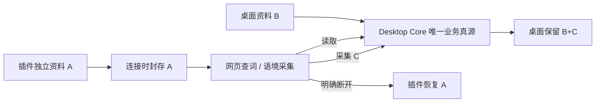
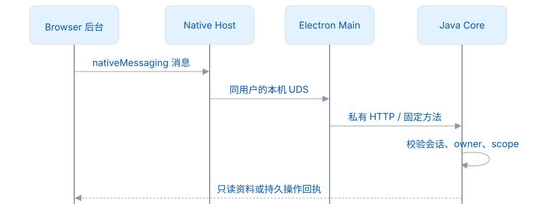
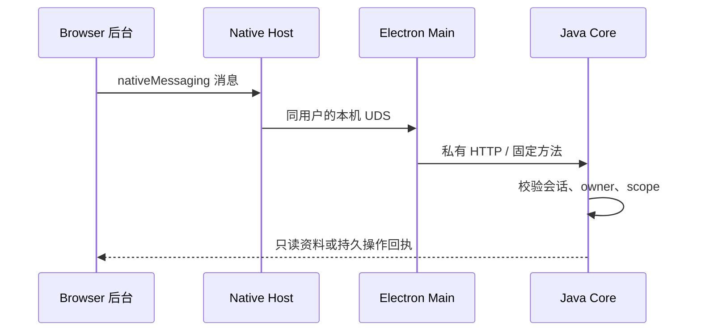

# 插件连接

适用：Desktop 1.0.0，LMCP 1.0.0。登录、LMSP 与云同步计划在应用 2.0.0 开发。最新版固定物料在 [resources/lmcp](../resources/lmcp/contract.json)，实现范围与测试结果见 [1.0.0 验收](测试与CI.md)。

## 连接后使用谁的资料

插件独立运行时是一个完整的本地设备；连接桌面后，作为桌面的网页阅读与采集入口。桌面仍提供全部学习、练习、规划和资料管理功能。插件的管理入口会提示打开桌面，用户可在连接设置中断开。

<!-- leximeet-diagram: figure-378a6f4089-01 -->
<picture>
  <source media="(prefers-color-scheme: dark)" srcset="diagrams/rendered/figure-378a6f4089-01.dark.svg">
  
</picture>

查看和编辑 Mermaid 源码

[图源文件](diagrams/figure-378a6f4089-01.mmd)

<!-- /leximeet-diagram -->

例如插件收藏 apple，桌面收藏 orange：连接后插件查桌面的 orange，apple 保留在插件封存资料中；采集 banana 写入桌面。断开后插件恢复 apple，桌面保持 orange、banana。连接不上传 A，也不会把 A 合并到 B。

短暂失联继续等待桌面恢复，不能偷偷切到独立资料或向 A 写入。明确断开才恢复 A。连接期间的资料不自动带回插件；未来云同步由用户单独选择。

## 本机链路

<!-- leximeet-diagram: figure-378a6f4089-02 -->
<picture>
  <source media="(prefers-color-scheme: dark)" srcset="diagrams/rendered/figure-378a6f4089-02.dark.svg">
  
</picture>

查看和编辑 Mermaid 源码

[图源文件](diagrams/figure-378a6f4089-02.mmd)

<!-- /leximeet-diagram -->

Native Host 随应用提供，使用 Electron 的 Node 运行能力，安装后的连接不依赖系统 Node 或 JDK。Core HTTP 只监听回环地址并使用私有令牌；插件不持有该令牌。Native Host 只搬运消息，不保存第二个学习数据库。当前实际平台验收为 macOS；其他平台不能仅因代码存在就认定通过。

## 用户操作

1. 启动桌面和词遇浏览器插件。正式 local 安装自动检测 Chrome/Edge 的已安装扩展，登记精确来源；隔离验收只登记本轮浏览器，不扫描日常资料。
2. 双方检测到对端后主动通知。点击通知，或在桌面「设置 → 插件连接」/插件设置中点击「一键连接」。浏览器弹出词遇的独立确认窗口；只有点击「确认连接」才封存 A、自动配对。无需抄码或填写认证信息。
3. 双方显示连接成功。插件网页查词与采集使用桌面资料；管理操作跳转桌面。通知被系统阻止时，设置入口仍可完成连接。
4. 临时退出桌面，插件显示等待恢复，采集失败显示原因；恢复同一桌面空间后重连，原插件资料仍封存。
5. 任一端点击「断开连接」：插件收到可信断开状态后恢复 A，桌面保留 B+C。临时掉线不会触发该动作。桌面「撤销授权」使信任失效，需要新一次用户确认。

发现对端后的提醒不代表授权，也不会启动尚未运行的 Desktop。每次邀请在 120 秒内有效，取消/过期后不会连接；已经接受但回执丢失时，后台保留原票据，恢复同一次连接结果。票据不进入通知、内容脚本、URL 或 UI。详细交互与接口见[自动发现与连接邀请](../resources/lmcp/docs/自动发现与连接邀请.md)。

长期配对、最长 24 小时的会话和最多 30 秒的读取租约分别管理。Port 关闭后，该连接的会话、读许可及网页授权失效；续发会话不会提前废止旧会话的在途调用。撤权后，缓存不能继续作为在线资料使用。

## 基础接口与扩展

| 能力        | 方法                                                                                                        | 用途                           |
| ----------- | ----------------------------------------------------------------------------------------------------------- | ------------------------------ |
| 连接 / 授权 | hello、requestConnection、getConnectionStatus、pair、resumeSession、renewSession、disconnect、revokePairing | 身份、配对、恢复、明确结束     |
| 阅读        | getWorkspace、matchWords、getWord、getPublicEntry、getChanges                                               | 桌面资源、个人覆盖、状态与租约 |
| 采集 / 回执 | recordEncounter、getOperation                                                                               | 遇见事务、防重、未知结果对账   |
| 导航        | openInDesktop                                                                                               | 打开词库、规划、设置或指定词   |
| 可选        | listNotebooks、listEncounters、registerHost                                                                 | 词本/遇见只读、插件能力注册    |

16 项必需、3 项可选。完整参数、错误与 Schema 见 [接口规范](../resources/lmcp/docs/接口规范.md)。公开 DTO 使用 WordRef、owner、revision，不直接透出内部 SQL 表或桌面完整 WorkspacePort。六种练习、FSRS、规划保存、笔记编辑和单词本管理是桌面内部用例，不通过这版 LMCP 在插件重复提供。

Browser、IDEA 等宿主能力可以不同。可选 browser/1 有 7 项受限方法；桌面只使用插件实际注册、用户授权的能力。本轮浏览器生产入口未注册这些网页反向能力，因此基础连接不依赖它们，也不宣称已完成反向网页操作。

## 身份、资源与写入

- 公共 WordRef 使用 Dictionary entryId、release、entrySchema；自定义词使用 UUID、词头和语言。大小写归一键只用于检索，不是唯一身份。缺资源明确返回，不偷偷更换 release。
- 候选来自桌面可用目标/个人覆盖/公共资源，连接插件不能再按自身 Lite 资源过滤桌面结果。每个输入都有匹配结果，截断要明确标记。
- owner 的 pairingId、desktopInstanceId、clientInstanceId、workspaceId、generation、authorizationEpoch 必须一致。Port/origin 再绑定会话，不能只验证词 ID。
- recordEncounter 校验真实来源、HTTP(S) URL、UTF-16 语境选区、目标词本和回收状态；保存个人覆盖、遇见、关系、revision 与回执在同一个事务中。采集不加分，不恢复已回收词，不用空笔记覆盖已有内容。
- Core 成功提交后由桌面发送采集结果系统通知，默认开启；「设置 → 采集与快捷键」可关闭。通知错误不改变保存结果，同一遇见事件的近期重试不重复通知。详见[采集方式与语境](采集与隐私.md)。
- mutationId 表示一次命令，eventId 表示同一次遇见。同事件同载荷重试不会再记一次；同 ID 不同内容冲突。超时先查 getOperation，不换 ID 自动重发。
- 导航限制固定 target，不接受路径/脚本。Core 先记录 pending，Main 收到 Renderer 实际路由 ACK 才确认 opened；崩溃导致未知时不重新打开。

当前构建物料必须与固定 1.0.0 快照一致；连接协商按 API major、最低 API 版本及必需能力判断兼容，不能因可选扩展或完整摘要不同就拒绝合法连接。物料在构建和运行前核验，不动态读取相邻开发仓库。

## 测试与发布

[本地测试启动](本地测试启动.md)提供一键启动、暂停/重启和人工检查。自动测试分四层：协议物料、独立 Native Host/UDS、真实 Java/SQLite、真实生产插件与桌面。模拟客户端通过不代表真实插件通过；源码运行通过也不代表随包 JRE 通过。

正式 1.0.0 前不兼容 0.x / rc 测试库，不实现旧协议双栈或旧接管导入。未知格式拒绝并保留原文件；当前模型的重启、事务恢复、封存恢复与回执仍必须验证。只使用新隔离资料验收，不在应用启动时自动清库。
