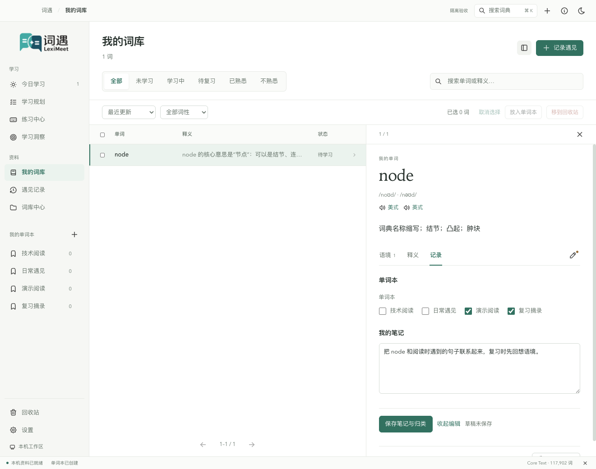
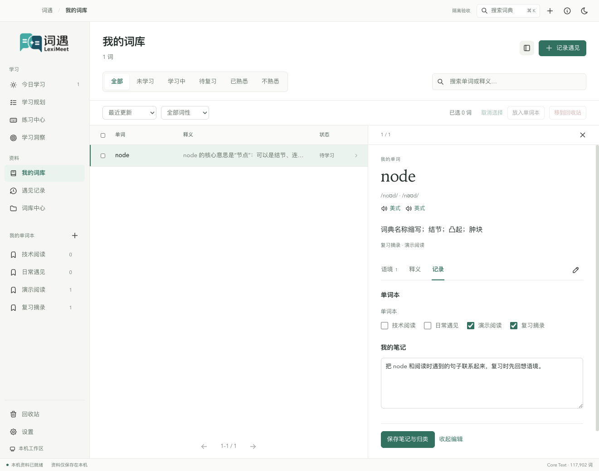
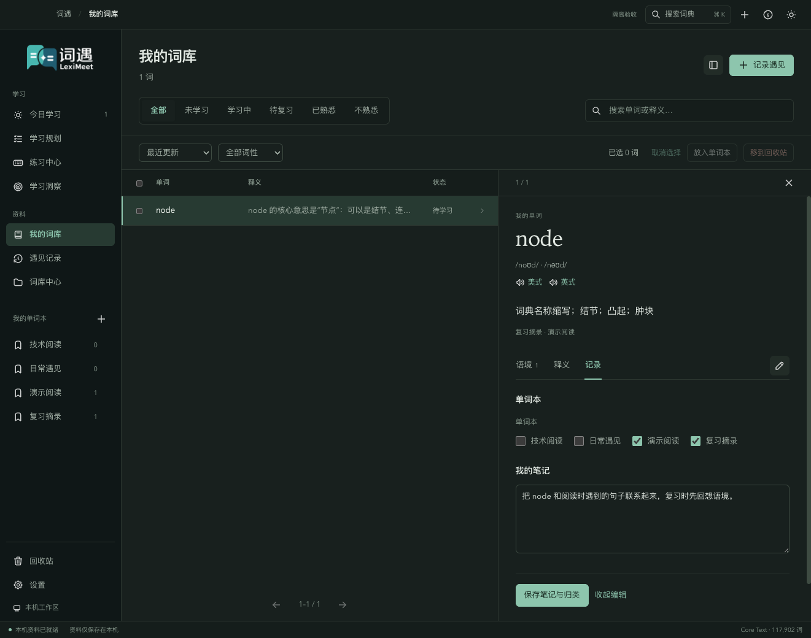
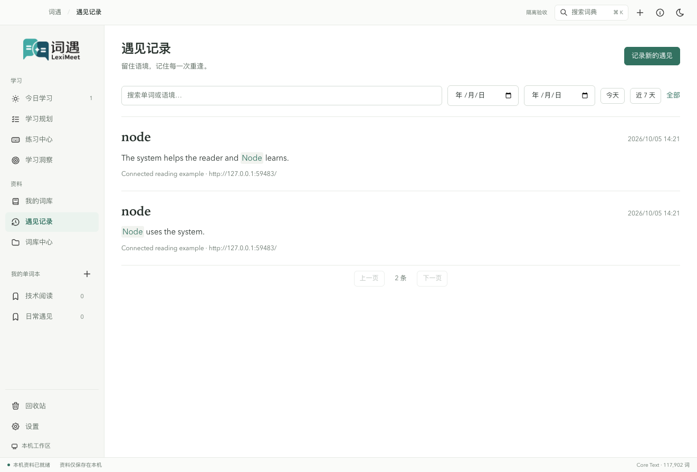

# 桌面端操作演示

按下面的顺序，可以完成一次「设置目标 → 记录语境 → 整理词库 → 练习 → 查看安排」的使用过程。示例使用公开句子和隔离资料；你也可以直接记录自己的单词，之后再设置学习规划。

图片保留应用导航与操作区域，便于找到入口。更完整的计分、通知与恢复规则见[使用指南](使用指南.md)和[学习与复习](学习与复习.md)。本轮补拍图片的来源与校验值见[截图来源](images/usage/截图来源.md)。

## 1. 首次打开与教学

1. 打开词遇，在欢迎卡片中选择「进入教学」。
2. 按教学卡片的动作操作：先认识导航，再选择目标、安排每日数量，最后完成一次练习。
3. 想回看操作时点「上一步」；暂时不学习时点「跳过教学」。以后可以从「设置 → 使用教学」再次进入。

<figure>
  
  <figcaption>教学邀请显示在主窗口中，侧边栏和当前页面仍可辨认。</figcaption>
</figure>

教学中的练习需要真正保存成功才能推进。正常练习时答对后默认自动下一词；教学会等待你完成当前步骤。

## 2. 选择目标与每日安排

1. 在侧边栏打开「学习规划」，点「设置学习规划」。
2. 在第一步选择词书。可以切换分类，或通过搜索寻找考试、专业词库。
3. 点「下一步」，填写每天新学、每天复习。首次默认新学 **10** 词、复习 **20** 词。
4. 如需系统提醒，开启「学习提醒」，设置开始和结束时间；默认 **08:00–20:00**。
5. 点「保存学习规划」。概览页出现目标、额度与学习预测，才表示保存完成。

<figure>
  
  <figcaption>第一步只选择目标；最终保存前不替换原来的规划。</figcaption>
</figure>

<figure>
  
  <figcaption>返回第一步时，已经填写的每日安排会保留。</figcaption>
</figure>

修改每日数量时用「调整计划」，更换词书时用「更换学习目标」。这两种操作都不会删除原有笔记、遇见或已经保存的学习记录。提醒题型在「设置 → 学习提醒」选择，默认看词选义，可多选轮换；间隔由应用在 25–35 分钟内随机安排。

## 3. 手动记录阅读中的一句话

以下示例记录 `node`，语境为 `Node connects a useful idea to another idea.`。

1. 打开「遇见记录」，点「记录新的遇见」。顶部加号也能打开同一入口。
2. 在独立遇见窗口填入单词和包含它的语境。公共释义由本地词典提供，个人理解可在词卡中保存为笔记。
3. 来源标题和网址按需要填写；检查句子后点「确认保存遇见」。
4. 回到「遇见记录」，确认新句子已出现。进入「我的词库」，也能找到这条收录的单词。

<figure>
  
  <figcaption>这是手动记录窗口；剪贴板识别默认使用系统通知。</figcaption>
</figure>

<figure>
  
  <figcaption>词头、句子、来源和时间分别显示，便于回看阅读情境。</figcaption>
</figure>

默认同一词的同一句子在滚动七天内只保存一次，大小写变化不另建记录。看到「此语境近期已记录」时，表示本次没有新增遇见；需要补充笔记时直接编辑该词。三种采集入口的脱敏与句子范围见[采集与隐私](采集与隐私.md)。

## 4. 阅读词卡，保存笔记和单词本归类

1. 打开「我的词库」，搜索 `node` 或直接点击对应行。
2. 在词卡的「语境」查看阅读句子，在「释义」阅读完整词典解释，在「记录」查看个人笔记和学习信息。
3. 点铅笔「编辑笔记与归类」，填写「我的笔记」。
4. 勾选需要的单词本，可以同时选多个。没有单词本时，先从侧边栏「我的单词本」旁的加号创建。
5. 点「保存笔记与归类」，确认页面显示保存后的内容。同一窗口内切换主页面或词条会保留草稿；退出应用前应保存需要的内容，未保存笔记不会跨应用重启恢复。

<figure>
  
  <figcaption>搜索和筛选作用于词库列表；点击一行后，在右侧阅读该词。</figcaption>
</figure>

<figure>
  
  <figcaption>示例先创建「演示阅读」「复习摘录」两个词本，再同时勾选。笔记、归类与保存按钮在同一画面中。</figcaption>
</figure>

<figure>
  
  <figcaption>保存后，「草稿未保存」消失，两个词本各增加一个词；公共释义仍由词典提供。</figcaption>
</figure>

  
查看黑暗主题下的同一操作

  <figure>
    
    <figcaption>切换主题后仍可继续编辑已有笔记和词本归类。</figcaption>
  </figure>

## 5. 筛选、批量归类与回收恢复

1. 使用「全部 / 未学习 / 学习中 / 待复习 / 已熟悉 / 不熟悉」切换状态。
2. 将「最近更新」切换为字母排序或词书顺序；词性和搜索可以一起使用。
3. 勾选需要的单词，或勾选表头选择当前页。切换页码或筛选会清空选择。
4. 点「放入单词本」，选择一个或多个单词本，再点「确认放入」。它会追加归类，保留原有单词本关系。
5. 不再需要的词可以点「移到回收站」。确认对话框显示词数，点确认后才回收；取消不会写入资料。
6. 在「回收站」选择单词并恢复。公共词典不会随回收操作删除，笔记和已保存分数仍保留。

<figure>
  
  <figcaption>批量操作只处理当前选择，不自动选中其他页。</figcaption>
</figure>

<figure>
  
  <figcaption>目标书中的词也可以回收，恢复后重新参与当前目标。</figcaption>
</figure>

## 6. 在六种方式之间练习

1. 打开「练习中心」，将「练习范围」设为「我的词库」或「今日任务」。
2. 点击对应的练习方式，按下面的动作作答。
3. 答对并确认保存后，保持结果至少一秒，再自动进入下一词；答错保留原题，可以订正。
4. 想从头练当前方式时，点范围右边的「重新开始」。它不清零已经保存的分数，也不改变其他方式的进度。

| 方式     | 怎样完成一道题                                                         | 怎样继续                                         |
| -------- | ---------------------------------------------------------------------- | ------------------------------------------------ |
| 单词列表 | 回想遮挡的内容，点「熟练 +1」或「不熟悉 −1」；遮挡按钮可切换中文与英文 | 列表保留各词的反馈记录；查看遮挡答案会按揭示处理 |
| 看词选义 | 看英文单词，点击一个中文释义选项                                       | 正确保存后选项保持着色，再自动下一词             |
| 单词临摹 | 沿着幽灵字母输入单词，输入完整且正确时自动确认                         | 正确 +1；已输入的字母清晰显示                    |
| 单词默写 | 看释义输入英文，输入完整且正确时自动确认                               | 无提示正确 +2；使用提示后可订正，本题不再加分    |
| 听音辨词 | 听发音，输入单词，点「确认答案」或按 Enter；需要时点「再听一次」       | 无提示正确 +1；自动换题还会等待本题发音结束      |
| 语境填空 | 读带空缺的句子，输入英文，点「确认答案」或按 Enter                     | 无提示正确 +2；没有有效语境时可换其他方式        |

<figure>
  
  <figcaption>查看被遮挡的答案属于提示操作，不能再按独立回忆加分。</figcaption>
</figure>

<figure>
  
  <figcaption>保存成功后先看清反馈，再进入下一词。</figcaption>
</figure>

<figure>
  
  <figcaption>临摹保留真实输入框，支持退格、方向键、选择和输入法。</figcaption>
</figure>

听音、默写或填空使用「提示」时，答案以幽灵文字显示，原来的输入仍能编辑。积分初始为 10，最低为 0；揭示或答错 −1。各方式共用该词的积分，但位置和草稿各自保留，例如临摹第 3 词与听音第 5 词互不覆盖。

<figure>
  
  <figcaption>提示显示答案，不自动把答案填进输入框。</figcaption>
</figure>

若页面提示「这次反馈尚未确认」，点「重试保存」恢复原操作。此时重新开始会被阻止，以免丢弃可能已经记入的结果；反复点击不会多记分。

## 7. 查看近期候选和学习预测

1. 回到「学习规划」，查看已完成初学、剩余新词和预计天数。
2. 切换 7 天、30 天、90 天或整个计划，查看按每日新学额度推算的曲线。
3. 点击近期日期，查看那天预计新学的具体单词；悬停单词可查看简短释义。
4. 当天实际安排仍以「今日学习」为准。额外采集的词可能先占用新学额度，所以目标书当天的候选会相应减少。

<figure>
  
  <figcaption>虚线按每天完成额度推算，不表示实际熟悉词数或未来复习到期。</figcaption>
</figure>

例如每天新学 10 词的计划，图中预测的是首次达到 20 分、完成初学的目标词数量。它不会提前保存成绩，也不会替你生成学习事件。详细例子见[词库与学习预测](词库与学习预测.md)。

## 8. 连接浏览器，在网页采集后回桌面查看

1. 启动桌面应用和装有词遇插件的浏览器。
2. 在桌面「设置 → 插件连接」点「一键连接」，也可以从插件发起连接。
3. 在插件的真实确认窗口点「确认连接」。确认前只是发现对端，尚未获得资料访问授权。
4. 在网页打开侧边栏，分析本页后选择单词，或用悬浮球采集阅读语境。
5. 回桌面的「遇见记录」检查新句子，再在「我的词库」查看对应的词与语境。
6. 需要独立使用插件时，在任一端明确「断开连接」。插件恢复原有独立资料，连接期间新增的遇见仍留在桌面。

<figure>
  
  <figcaption>浏览器连接后采集的两条不同句子已出现在桌面。单词大小写按同一词处理，不同语境仍分别保存。</figcaption>
</figure>

浏览器操作的完整网页与侧边栏演示见 [Browser 图文演示](https://github.com/leximeet/leximeet-browser/blob/main/docs/实操演示.md)。连接规则和临时失联处理见[插件连接](插件连接.md)。

## 接下来

- 想开启剪贴板与系统通知：阅读[采集与隐私](采集与隐私.md)、[学习与复习](学习与复习.md)。通知样式和权限需在自己的操作系统中确认。
- 想复现一遍而不影响日常资料：使用[本地测试启动](本地测试启动.md)的一键隔离环境。
- 想安装自己的构建：使用[本地打包与安装](本地打包与安装.md)，不要把源码启动和正式安装混为同一次验证。
