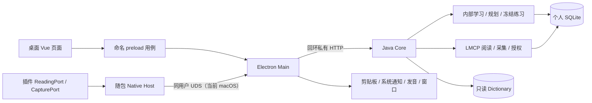

# Desktop 架构与数据模型

适用：Desktop 1.0.0，LMCP 1.0.0，个人 schema 100。当前模型直接初始化，不转换预发布测试库；遇到未知格式时拒绝打开并保留原资料。正式 1.0.0 发布后，再维护真实资料的跨版本升级。

<!-- leximeet-diagram: figure-a3cd18cd19-01 -->
<picture>
  <source media="(prefers-color-scheme: dark)" srcset="diagrams/rendered/figure-a3cd18cd19-01.dark.svg">
  
</picture>

查看和编辑 Mermaid 源码

[图源文件](diagrams/figure-a3cd18cd19-01.mmd)

<!-- /leximeet-diagram -->

## 分层

| 模块                | 职责                                        | 不跨越的边界                                          |
| ------------------- | ------------------------------------------- | ----------------------------------------------------- |
| Renderer            | 页面、表单、游标和输入草稿                  | 不算权威积分，不接触 SQLite、授权密钥或 Core 令牌     |
| preload / bridge    | 固定命名用例、来源校验、JSON DTO            | 没有任意路径、shell 或通用 IPC                        |
| Main                | Core 进程、原生窗口、通知、发音、连接网关   | 不直接写学习分数；网页与桌面 IPC 分开                 |
| Native Host         | 有界 JSON 帧与同用户传输                    | 不存业务库，不知道 Core HTTP 令牌                     |
| Core 本机业务       | 规划、学习规则、固定题目、判题、事件、投影  | 本机与通知练习共用可信判题                            |
| Core LMCP           | 配对、会话、owner、只读词卡、采集事务、回执 | 外部 16 必需 + 3 可选接口；没有远程练习或首次资料导入 |
| SQLite / Dictionary | 单写入者、事务 / 只读公共资源               | 个人行为按需保存，不复制整本目标词典到个人表          |

协议物料固定在仓库内，并通过摘要核验，候选不会动态读取相邻仓库。内部 DTO 与跨端 DTO 分开，内部学习服务不依赖插件是否连接。插件功能层只接 ReadingPort/CapturePort，通过它们切换资料来源，不复制桌面的完整业务 API。

旧词条/词本/用户标签基础 CRUD 已退休；资料变更走当前 `desktopCommand`。用户标签不再有存储和编辑能力，正式内部 DTO 不携带个人释义或标签占位。Dictionary 的词形语法信息保持。

## 核心数据

| 内容                          | 归属与规则                                                  |
| ----------------------------- | ----------------------------------------------------------- |
| 公共词条 / 词书               | Dictionary entry_id + release + entrySchema；归一键仅检索   |
| 个人词 / 笔记 / 多词本        | 本机个人资料；自定义词 UUID，公共词保存引用及个人笔记       |
| 学习规划                      | 目标、额度、提醒开关与范围原子保存；默认 10/20、08:00–20:00 |
| 遇见事件                      | 原句、选区、来源、稳定 eventId；采集本身不加分              |
| 练习 / 撤销事件               | 实际答案 / 信号及可信判题；由有效事件重建积分和 FSRS        |
| 冻结题目 / 队列 / 草稿        | Core 固定队列、选项、答案、辅助状态，重启可恢复同模型进度   |
| 配对 / 会话 / 回执 / revision | 持久配对、短期端口会话、owner 隔离、原子幂等回执            |
| 设备偏好                      | 主题、发音密钥、通知调度和 OS 权限留在本设备                |
| 教学                          | flowVersion=3；真实操作成功或确认参观后推进                 |

我的词库 = 当前目标成员 ∪ 活动手动词。先按状态 / 搜索过滤，再计数分页；默认每页 40、最多 100，不把 Full 的全部词传入 Renderer。查询、详情和任务使用一致 asOf；时间衰减只读计算，不为读取修改 revision。

设置读取共用 SettingsSupport.normalize，使桌面状态、独立快照和采集政策返回一致的默认值。同模型候选新增偏好时，只在读取投影中补齐缺省项，不覆盖用户值、不改写原 JSON，也不增加数据库迁移。

公共词典使用可重建的只读 SQLite 索引，当前 indexVersion=3，与个人 schema 100、Dictionary 0.0.3 分开。精确词头按 `(headword,id)` 覆盖索引查找，归一查询键另有索引；两者不可互换，部分原词头与 lookup_key 不同。`entry_parts_of_speech` 从真实义项提取词性并使用覆盖索引，在分页之前过滤，不改公共词身份或个人表。构建缓存和活动指针校验索引版本，过期公共缓存回到当前随包 Core，私人数据库不清空。批量网页匹配仍遵守 LMCP 5 秒读取期限。

## 练习与状态

积分 0–30，初始 10。首次到 20 完成初学，最早次日进入自动复习；到 30 保护 72 小时，然后每 48 小时减 1，最低衰减到 20，再有自动复习资格。30→30 不重计时，降到 30 以下再实际达到 30 才重开周期。

默写/填空正确 +2，其他模式 +1；错误/揭示 −1，最低 0；同题首次反馈只计一次。临摹和提示不代表独立回忆。积分用于表示熟悉程度和筛选单词，FSRS-6 用于计算自动复习到期；投递或忽略通知均不产生学习事件。详见 [单词状态与复习](学习与复习.md)及 [Core 统一学习规则](../core-java/docs/统一学习规则.md)。

practice-session 管输入、游标、串行切换与稳定 submissionId；Core 冻结题并决定 correct、effective 与分值。返回回执不匹配时保留原操作，不自动换 ID。列表、普通打字和通知练习复用本机服务，LMCP 没有这套远程练习接口。

提示有两个阶段：确认 reveal 反馈，再读取原冻结题目。前者未确认时保留 submissionId 重试；前者已确认而读取失败时只重读相同 attemptId。hintReadPending 与未确认反馈分开，不能把读失败变成再次扣分，也不能阻止用户明确重开。答案先保存到草稿，再刷新最新详情。

## 窗口与异步恢复

DesktopShell 处理固定导航；Main 向主 Renderer 发送 requestId，收到路由接受 ACK 才确认 openInDesktop 成功。其他窗口和子 frame 不能确认。教学或对话框占用时可以拒绝；超时结果保持可查询，不自动重开。

library-query 按代次处理列表和详情；查询结果为空时清空旧词，迟到的响应不能恢复旧选择。WordCard 用文本节点显示个人文本，不将其作为 HTML。useWordDraft 刷新时不覆盖脏草稿。规划发生 expectedRevision 冲突时保留输入。资源升级先在临时空间构建和校验，再原子切换；失败时保留当前资源。

## 采集与提醒

剪贴板经 Core 与当前目标取交集，无目标或无匹配不通知；逐词 show 回执后开始 10 秒决策。通知失败不采集、不隐式弹替代窗；用户可以选择独立弹窗。目标变化、关闭、切换模式和退出撤回待处理项。手动和插件采集可增加目标外词。

Main Inbox 的 id 同时作为本机 captureClipboard.operationId。Core 复用回执存储的私有命名空间，在事务中保存输入摘要与安全结果；使用原 ID 和原参数重发时先恢复回执，参数不同则拒绝。captureOperationReplayed 表示恢复原操作，不能当作再次采集成功。记录原文只用于当前处理，不写入回执；队列 ID 只在本次 Main 生命周期内保留，退出时撤回通知，不自动重播剪贴板历史。对外 LMCP eventId 和冻结协议不变。

recordEncounter 把个人覆盖、遇见、词本关系、revision 与回执放在一次事务中。来源与选区严格校验，不复活回收词、不创建不存在词本、不用空笔记覆盖原内容。目标外采集不套用剪贴板过滤。

StudyReminder 在范围内随机 25–35 分钟，平均 30 分钟；前台、无任务、停用或范围外不投递，休眠错过不补发。题型在设置选择，默认看词选义；实际答题才进入本机判题事务。

## 插件与未来云端

连接时插件 A 本机封存，桌面 B 不变；连接采集 C 后桌面 B+C，明确断开插件恢复 A。短暂失联维持桌面归属。1.0.0 不导入事件、不合并两端分数，也不传完整学习库。

2.0.0 再实现账号、LMSP 和多个独立设备的事件合流。IndexedDB 与 SQLite 不必采用相同的 DDL，但业务身份、关系、事件含义和重放规则需要一致。不要以本地读取 DTO 替代未来的云同步模型。开发入口见 [开发与跨端学习接入](开发指南.md)，连接规范见 [插件连接](插件连接.md)。

## 本轮恢复与采集边界

练习确认先落盘，再发布教学进度；原回执未知时保留身份并显示重试保存。题目不可用时返回 unavailable/reason，不能保留上一题的正确状态。Markdown 用白名单结构和文本节点渲染，不执行 HTML。CapturePolicy 在采集事务内统一处理句子、脱敏、长度、位置和七天重复检查；遇到重复内容时返回已有 Encounter，不增加 revision/事件/通知。连接插件以 getWorkspace.capturePolicy 为当前采集政策的权威来源。

Core 已计分而确认草稿未保存时，Renderer 保留原提交和当前教学步骤。后台快照仍刷新业务事实，但不能越过这个恢复入口推进教学；原身份恢复成功才释放教学显示。用户明确跳过或重置教学的选择仍生效。这是窗口内的显示顺序，不回滚 Core 分数，也不增加跨端状态或数据库格式。

业务 Clock 与认证时钟分离。仅 test 环境的专属文件可推进学习/提醒/采集日期；LMCP期限保持真实时间。首装、七天与同 schema100 候选替换分别验收，见[日常使用与升级测试](日常使用与升级测试.md)。

## 入口与合同的收敛

正式 UI 只使用 `frontend/src/desktop` 和两个共享组件。旧 ECDICT、联网翻译、ZIP 内容包与旧实验学习接口已退休。三层命名 IPC 白名单必须一致；新增业务通常先扩展 Core 的桌面用例，再由 Renderer 调用对应动作，不能增加通用 HTTP、文件或命令入口。

公共词典仍经 `TextDictionaryService` 装配；词典升级使用当前固定发布物，发音、采集、原生通知、Native Host 和冻结 LMCP 合同保持独立。设置、词卡布局及完整资料导入在 Main 中共用提交顺序；失败时执行补偿，或进入明确的恢复状态。
