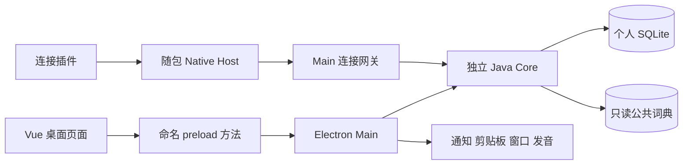
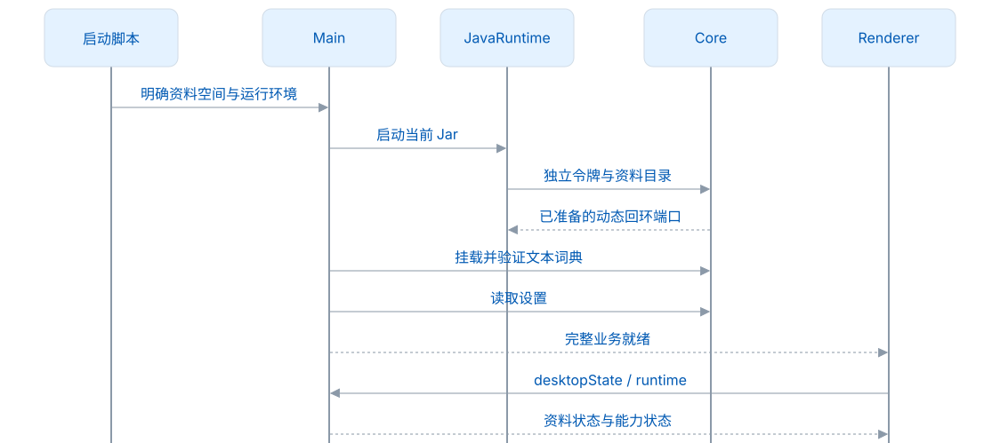
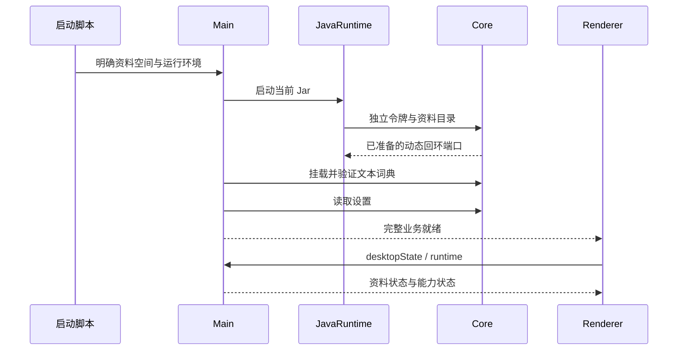
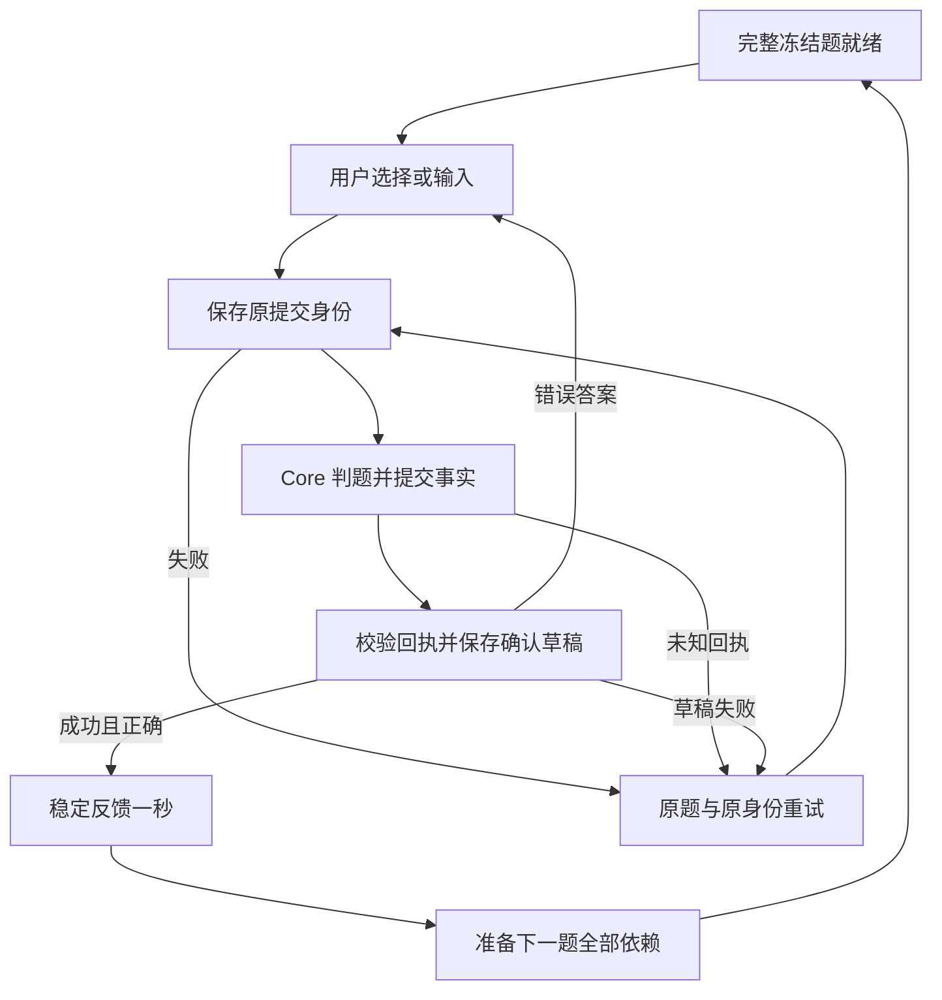

# Desktop 架构设计

可以从一个场景理解桌面端：用户选择学习目标，在练习中心选中释义，随后通过浏览器插件采集一条新语境。页面呈现操作与反馈，Main 接入桌面能力，Core 判题并保存事实。三者共用一个工作区，各自遵守职责和权限边界。

本文以当前 Electron Egg 5.0.1 / Electron 44.3.0 / Vue 3.5.42 / Java Core 1.0.0 源码为准。词遇使用个人 schema 100、学习规则 v2、Dictionary 0.0.3 和固定 LMCP 1.0.0；这些版本分别管理。

## 1. 运行结构

<!-- leximeet-diagram: figure-75a9c50a16-01 -->
<picture>
  <source media="(prefers-color-scheme: dark)" srcset="diagrams/rendered/figure-75a9c50a16-01.dark.svg">
  
</picture>

查看和编辑 Mermaid 源码

[图源文件](diagrams/figure-75a9c50a16-01.mmd)

<!-- /leximeet-diagram -->

| 层          | 代码位置                                 | 做什么                                   | 不做什么                                   |
| ----------- | ---------------------------------------- | ---------------------------------------- | ------------------------------------------ |
| 页面        | `frontend/src/desktop/`                  | 渲染、表单、当前题输入和恢复入口         | 不操作 SQL，不自行决定积分                 |
| 前端 API    | `frontend/src/lib/api.js`                | 固定业务方法、去掉 Vue Proxy 后传 JSON   | 不开放 IPC 通道名、任意 URL 或任意文件路径 |
| preload     | `electron/preload/bridge.js`             | 暴露允许的方法和应用事件                 | 不暴露 Node、Core token 或通用 invoke      |
| Main        | `electron/main.js`、`electron/services/` | 生命周期、源校验、原生能力和用例调度     | 不修改权威学习状态                         |
| Core        | `core-java` 独立子模块                   | 身份、规划、冻结题、可信判题、事务与回执 | 不监听剪贴板，不决定窗口是否聚焦           |
| Native Host | `electron/native-host/`                  | 有界消息帧和同用户本地传输               | 不存另一份桌面业务库                       |
| 资源        | `resources/dictionary`、`resources/lmcp` | 固定公共词典与规范物料                   | 不混入私人笔记或测试资料                   |

Core 的物理表和具体 Java 类见 [Core 架构设计](../core-java/docs/架构设计.md)。Desktop 不复制 Java 源码；修改 Core 应先在独立仓提交，再同步 gitlink。

## 2. 启动、资料和退出

`profiles.cjs` 决定 local、demo、test 的独立资料目录。`egg-application.cjs` 给 Electron Egg 绑定当前资料路径，Main 在框架获得单实例锁后启动 Core。`java-runtime.cjs` 为这次 Java 进程生成令牌，并把 Jar 复制到本次运行目录，避免开发过程中重建源 Jar 破坏已加载进程。

首次正式发布使用 `workspaces/v1` 资料空间；未发布试用库原地保留，开发库为 `.runtime/dev-v1`。正式后续版本继续维护这个空间，不因应用版本变化而换库。显式指定的资料目录不改写；旧格式在打开前安全拒绝，详见[本地打包与安装](本地打包与安装.md)。

<!-- leximeet-diagram: figure-75a9c50a16-02 -->
<picture>
  <source media="(prefers-color-scheme: dark)" srcset="diagrams/rendered/figure-75a9c50a16-02.dark.svg">
  
</picture>

查看和编辑 Mermaid 源码

[图源文件](diagrams/figure-75a9c50a16-02.mmd)

<!-- /leximeet-diagram -->

窗口壳可以先显示，业务请求要等待核心完整就绪；窗口出现并不表示数据库和词典已经可用。启动失败时保留应用壳并提供明确的恢复入口，运行时状态与业务快照分别管理。

退出会停止提醒、采集、网关和自有 Core 子进程，回收本次运行 Jar 副本。隔离双端验收脚本还会在会话结束后回收自己的应用、业务 profile 和扩展副本，保留小日志与验收记录；不删除用户指定的外部应用包或活跃会话。

正式资料只由当前 Core 持有，拒绝未知 schema 而不自动清空。公共词典索引可以重建，个人事实不能按缓存处理。目录和脚本使用见 [本地测试启动](本地测试启动.md)。

## 3. IPC 和网络边界

Main 接收 IPC 时同时检查受控主窗口、顶层 frame 和准确业务文档 URL。新窗口导航和 webview 默认拒绝；采集编辑器只开放它需要的 `captureAction`。Renderer 没有访问 arbitrary path、shell 或 Core token 的通道。

`bridge.cjs` 将允许的命名方法适配到 Core 私有回环 HTTP。Main 持有的启动 token 与 LMCP 连接票据分开，外部网页不能借桌面私有 API 读取工作区。大备份走 Main 与 Core 文件流，不把整份二进制或本机路径放进普通 IPC。

Native Host 的真实 extension origin、连接 ID 和同用户传输由网关产生，不能相信插件正文自报的来源。LMCP 的字段、大小和授权检查仍由固定规范与 Core 执行。详见 [插件连接](插件连接.md) 和 [安全与许可](安全与许可.md)。

## 4. 前端有三种不同状态

| 状态         | 归属                   | 示例                                | 更新方式                 |
| ------------ | ---------------------- | ----------------------------------- | ------------------------ |
| 工作区事实   | Core                   | 学习目标、成绩、遇见、笔记、修订    | 查询和已提交回执         |
| 页面草稿     | 页面控制器 + Core 断点 | 输入、游标、未确认提交 ID、规划表单 | 本页持有，按命名用例保存 |
| 设备运行状态 | Main                   | Core 是否连接、播放进度、通知能力   | runtime / 应用事件       |

`useDesktop.js` 负责响应式适配；`workspace-controller.js` 将写入与刷新串行化，防止先发后到的快照覆盖较新结果。Practice、Library、Plan 各自持有草稿，不因为其他页面刷新就覆盖正在编辑的内容。

教学还需要控制状态的发布顺序：Core 确认一次练习后，先将当前页的确认草稿落盘，再发布可能改变教学页面的工作区状态。草稿保存失败时，保留原提交 ID 和当前教学步骤，避免页面卸载后失去恢复入口。

## 5. 练习控制器与视图

`PracticePage.vue` 渲染题干、选项、输入和反馈；`practice-session.js` 持有当前范围、模式、cursor、attemptId、pendingSubmission、重复次数和定时推进。`SpellingInput.vue` 使用真实原生输入层处理输入法，临摹的未输入字母只是弱视觉提示。

<!-- leximeet-diagram: figure-75a9c50a16-03 -->
<picture>
  <source media="(prefers-color-scheme: dark)" srcset="diagrams/rendered/figure-75a9c50a16-03.dark.svg">
  
</picture>

查看和编辑 Mermaid 源码

[图源文件](diagrams/figure-75a9c50a16-03.mmd)

<!-- /leximeet-diagram -->

正常保存的 `pendingSubmission` 是幂等恢复标记，不等于错误。等待时只更新固定高度反馈行，显示“正在保存”，已选选项保持着色；保存结束才显示正确或错误反馈。恢复红条只在操作结束后还有未知结果或真实错误时出现，避免每次点击使题卡上下跳动。

答案正确且确认保存后，开始一秒计时。听音辨词的自动推进还会读取当前音频 cue、wordId、attemptId，只等待本题的加载、播放和完成回执；音频结束、失败或停止后即可继续。额外等待最多 30 秒，旧题回调不能阻塞新题。下一题的词条、草稿和冻结选项全部准备好后，才一次性发布；准备期间保留上一题。定时器绑定题目 attempt 和加载代次，切换模式、重开、切换范围、离开页面或关闭自动下一词时，都会取消旧题的推进。答错、回执缺失或保存失败时，不会自动前进。

如果回执未知，选项与输入不能改成另一答案来覆盖原提交；用户使用“重试保存”恢复原事件。连续点击或 Enter 不加快自动推进，也不会写两次积分。

## 6. 其他页面怎样避免过期结果

| 控制器/组件                                   | 现有保护                                             |
| --------------------------------------------- | ---------------------------------------------------- |
| `library-query.js`                            | 以代次区分搜索和详情，旧响应不能复活旧选择           |
| `useWordDraft.js`、`WordCard.vue`             | 脏草稿不被刷新覆盖，编辑携带 expectedRevision        |
| `PlanDialog.vue`、`PlanPage.vue`              | 两步表单先预览再原子保存，换步重置滚动，返回保留输入 |
| `OnboardingGuide.vue`、`guide-interaction.js` | 真实目标与可操作范围，提供上一/下一步和恢复目标      |
| `ReadableText.vue`、`ReadableInline.vue`      | 用允许的文本结构渲染 Markdown，不执行词典/笔记 HTML  |
| `CaptureWindow.vue`                           | 独立采集编辑器，不嵌入当前学习页面                   |

这些保护分别针对不同用例，不能用一个全局 loading 静默丢弃所有页面事件。查询中、业务确认中和资料冲突时，需要给用户不同的反馈。

## 7. 系统能力分工

| Main 服务                                       | 输入/依赖                             | 输出与边界                                         |
| ----------------------------------------------- | ------------------------------------- | -------------------------------------------------- |
| `native-capture.cjs`、`clipboard-inbox.cjs`     | 复制文本、目标匹配、安全政策          | 逐词通知和决策，默认到时采集；失败不假装通知已送达 |
| `capture-window.cjs`                            | 明确手动/快捷键请求或用户选择弹窗提醒 | 独立编辑窗口，写入仍调用 Core                      |
| `study-reminder.cjs`、`study-notifications.cjs` | 到期题、设备时间范围、提醒类型        | 默认看词选义单题，作答才记录学习                   |
| `pronunciation.cjs`、providers                  | 用户发音请求、提供者配置              | 音频与播放状态，提供者密钥留 Main                  |
| `plugin-capture-notifications.cjs`              | 实际成功的连接采集回执                | 默认成功通知，同回执不重复通知                     |
| `browser-discovery.cjs`、connection services    | 本机插件发现、真实用户确认            | 邀请、连接状态、明确断开                           |
| `text-dictionary.cjs`、worker/index             | 固定资源、校验和当前指针              | 有界构建/挂载，失败保留已用资源                    |

提醒频率、音量、主题、OS 权限属于设备偏好；稳定词条、遇见和学习事实属于资料。不要将“通知已显示”当作“用户已答题”。

## 8. 包与测试

应用包包含前端产物、Main、当前 Core Jar、随包 Java、Native Host、词典和原始第三方许可。`verify-package-materials.cjs` 会读取实际应用包中的内容进行核验；源码目录中存在某个文件，不能证明它已经随包分发。

测试覆盖纯会话单元、真实 Core/HTTP、Native 传输、隐藏的原生 Electron UI，以及源码和随包 Browser 联调。原生 fixture 根据业务页面绑定主窗口，实际调整窗口后再核验 renderer 尺寸；窗口保持隐藏、不可聚焦，默认静音。macOS 的只读焦点监测从启动持续到退出。不同层的测试结果不能互相替代，最新结果见 [测试与 CI](测试与CI.md)。

1.0.0 不包含云登录、LMSP 或插件独立资料导入。未来功能先保持同一身份和事务边界，不为连接模式在插件重建另一份桌面学习核心。
