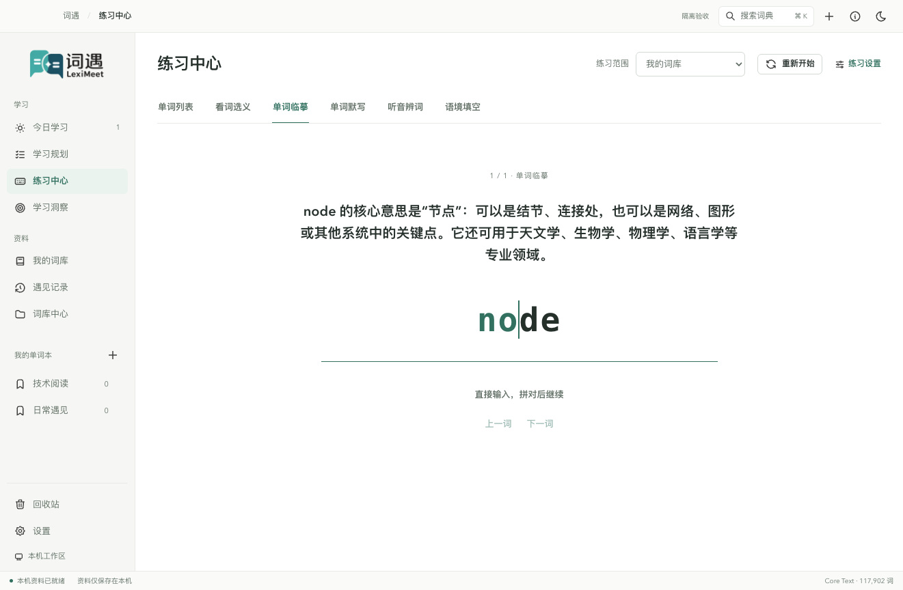
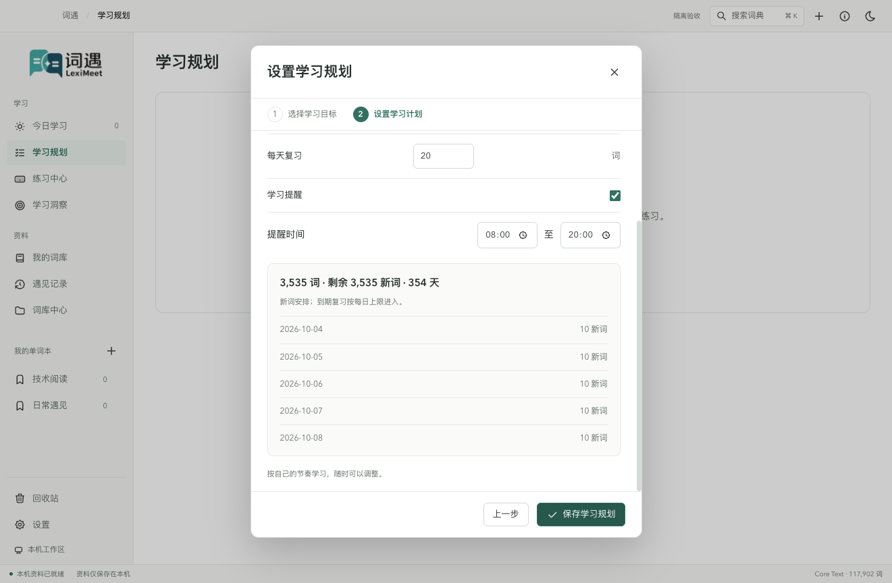
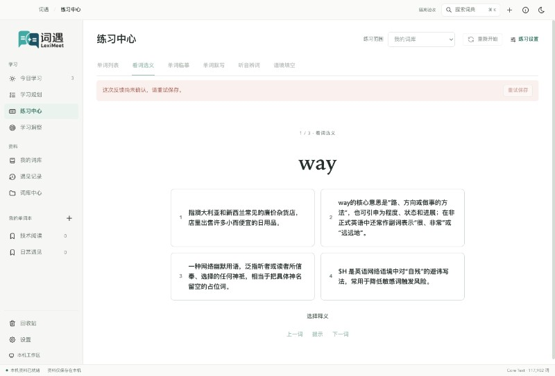
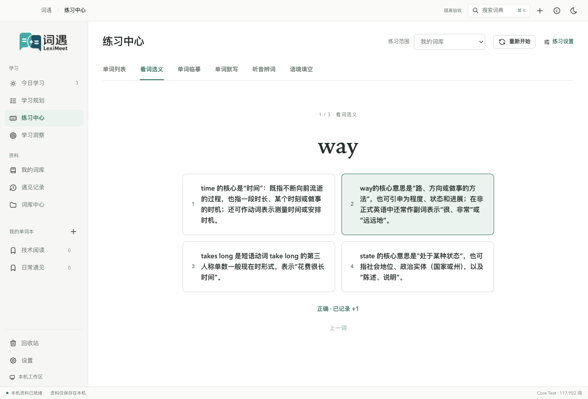
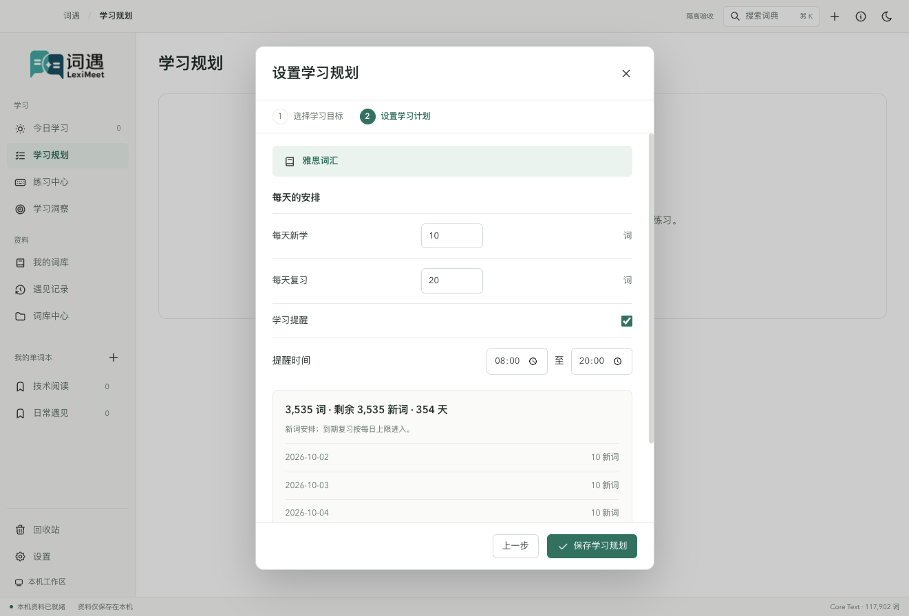
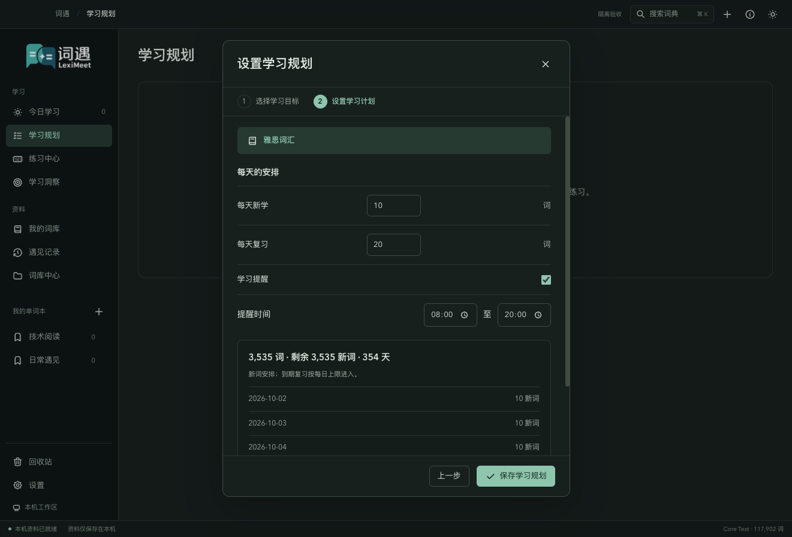
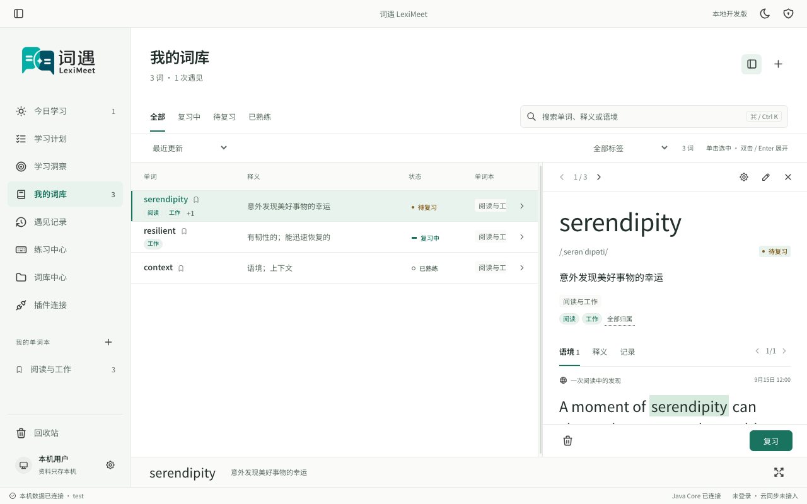

# 桌面界面与使用教学

## 桌面工作区

### 临摹提示的实际对照

下面两张图来自同一单词、相同输入位置与窗口尺寸的真实应用。未输入的字母从正文强度改为淡色幽灵提示，已经输入的部分与光标保持清晰；黑暗主题也使用同一套颜色令牌。

| 调整前                                                  | 调整后                                           |
| ------------------------------------------------------- | ------------------------------------------------ |
|  |  |

### 学习规划换步的实际对照

选择目标后进入计划设置，内容回到顶部，先看目标与每日新学，再看复习和提醒；返回上一页保留草稿。下面是同尺寸真实窗口：改前继承目标列表的滚动位置，导致「每天新学」被藏在上方；改后首屏完整呈现。

| 调整前                                                                 | 调整后                                                            |
| ---------------------------------------------------------------------- | ----------------------------------------------------------------- |
|  |  |

改前图来自独立恢复的旧 PlanDialog，其他组件和 Core 使用当前物料，只比较此滚动交互；它不是旧完整版本验收。改后图来自当前真实应用，使用公开合成资料。

窗口顶部集中放置当前位置、词典搜索、快速记录、使用教学和主题切换。macOS 使用原生红黄绿按钮与可拖动标题工具栏；工具栏内的操作按钮正常接收点击。其他系统保留原生边框。

左侧按「学习 / 资料」分组，单词本单独排列，设置与回收站固定在下方。通知集中在状态栏，避免保存成功时挤动正在阅读的页面。主内容使用紧凑的标题与操作栏，词卡保持平铺阅读，宽窗停靠右侧，窄窗排在列表下方。

| 窗口内操作             | macOS                | Windows / Linux |
| ---------------------- | -------------------- | --------------- |
| 搜索整个本地词典       | ⌘ K                  | Ctrl K          |
| 打开设置               | ⌘ ,                  | Ctrl ,          |
| 按导航顺序切换七个页面 | ⌘ 1–7                | Ctrl 1–7        |
| 列表上一词 / 下一词    | 聚焦列表行后按 ↑ / ↓ | 同左            |
| 跳过当前教学           | Esc                  | Esc             |

快捷键只作用于词遇当前窗口。列表保留键盘焦点，词卡在旁边更新；输入框里的上下键仍可编辑文字。笔记和归类草稿在本窗口的词条与页面间切换时保留；退出前请保存需要保留的笔记。

## 词库与阅读

顶部保留搜索和主要操作。「词库操作」收纳收藏单词，「记录遇见」打开独立采集窗口。单词本删除入口在悬停或键盘聚焦后出现，删除前通过对话框确认。创建单词本使用独立对话框，Esc 退出，焦点不会穿到背景页面。

词库和词本提供全部 / 未学习 / 学习中 / 待复习 / 已熟悉 / 不熟悉筛选，按积分与学习经历共同判断，见[单词状态与复习](学习与复习.md)。切换回第一页，支持方向键和 Home / End，回收站保留恢复视图。

遇见记录以单词为主要信息：词头使用 24px 加重文字，原句为 15px，来源和时间为 12px。语境以纯文本显示并安全高亮目标词，保留换行、长句与完整路径，在窄窗口中自动换行。

列表固定行高，单词、释义、状态按列对齐；长释义在列表中省略，在词卡中完整阅读。宽窗中列表和右侧词卡各自滚动；窗口不足以容纳双栏时，词卡排到列表下方。词卡可收起再展开。搜索、范围与翻页更新后，详情必须属于当前结果；无结果显示空状态，不留一个还能保存的旧词。

词卡先展示词头、音标、简释和发音，再按「语境 / 释义 / 记录」阅读。语境优先展示真实遇见，正文标出当前单词；没有遇见时，词典例句会明确标注来源。「释义」按需展开完整词条。学习文章的 Markdown 标题、列表、强调与引用按阅读层级排版，不显示原始 ###；原始 HTML 只按文字展示，不执行脚本或加载来源图片。「记录」查看笔记、归类与学习信息，点击铅笔才进入编辑。未保存草稿保留在当前窗口；保存后标记消失，版本冲突会保留输入并提示重新载入。

适中词卡先显示最近一条遇见，点击后可展开其余语境；选择包含「全部遇见」的词卡等级后，默认显示全部记录。

设置中的词卡显示偏好仍可控制模块可见性；阅读分组固定为上述三栏，记录栏内模块按保存的次序显示。

## 批注教学

练习答对并确认保存后，结果保留一秒再自动进入下一词；错误保留原题。连续点击和 Enter 不加速这段反馈，也不重复计分。换题的资料准备期间保留上一题内容，完整新题就绪后再替换，避免白屏闪动。切模式、切范围、重新开始或离开页面取消旧题的推进；保存失败与未知回执只开放恢复入口，不自动换题。

单词临摹使用幽灵文字：尚未输入的字母淡显，已输入正确字母清楚着色，错误位置独立提示。默写不显示未输入答案；两种输入都保留真实焦点、退格、选择、方向键与输入法。明暗主题共享这些状态，不依赖逐字试错给默写泄露答案。

练习中心的「练习范围」右侧提供「重新开始」：保持当前范围和练习方式，从第一词开始新一轮，清空本轮输入、答案揭示和列表反馈，重新遮挡中文。已经保存的积分、学习记录、每日完成量与 FSRS 不撤销。加载、提交或范围切换时按钮暂停；回复未确认时显示「重试保存」，重发原事件，不重复计分。教学推进先持久化已确认草稿再切页，详情刷新失败不会重新锁住已经保存的反馈。

插件采集成功使用系统通知，默认开启；开关在「设置 → 采集与快捷键」。其结果通知与剪贴板的采集确认提醒分别控制。

首次安装与全新隔离空间先显示「欢迎使用词遇」邀请，选择「进入教学」或「跳过教学」。进入教学不计入完成项，也不提前创建目标。教学浮窗带进度、高亮、连线与箭头，指向当前真实操作。

共 13 项，顺序如下：

| 项目                 | 完成方式                                                                                     |
| -------------------- | -------------------------------------------------------------------------------------------- |
| 认识侧边栏           | 首项介绍学习、资料和底部设置入口，卡片「下一步」继续                                         |
| 选择学习目标         | 默认雅思，可改选；下一步进入计划草稿，最终确认才保存，也可「暂不设置」                       |
| 安排学习节奏         | 每天新学 / 复习、学习提醒和时间范围；保存或「暂不设置」                                      |
| 回想一个单词         | 列表默认遮挡中文，一键改遮挡英文；回想后点熟练 +1 / 不熟悉 −1；空词库可直接听讲              |
| 听单词发音           | 点击美式或英式，等待当前音频自然播放结束；取消或失败不完成                                   |
| 试一次单词临摹       | 逐字输入，拼对自动完成；空词库可跳过操作，不制造教学词条                                     |
| 剪贴板识别           | 讲解当前目标词的语境采集，无目标时不提醒；可操作圈出的识别开关，也可用「下一步」继续         |
| 认识回收站           | 点击回收站参观；无需删除或恢复，卡片「下一步」继续                                           |
| 浏览词库中心         | 查看本机词典与词库管理，卡片「下一步」继续                                                   |
| 查看学习洞察         | 查看统计，卡片「下一步」继续                                                                 |
| 外观、发音、采集设置 | 分三项讲解；外观和发音控件锁定，采集快捷键可选操作；卡片「下一步」继续，最后点击「完成教学」 |

每项实际完成后有烟花；音频未播完不提前庆祝。系统开启减少动态效果时关闭烟花。创建单词本、填写遇见、笔记与资料导入导出不加入本轮教学。

从第二步起可点击「上一步」回看，已保存的资料与完成项仍保留，不会再次播放烟花。可以拖动卡片顶部；聚焦「移动教学卡片」后，也可按方向键微调。卡片会自动避开当前操作、第一行单词、题干、词卡释义，以及本步的输入和保存控件。调整窗口尺寸后，卡片仍保持在窗口内；最小窗口中的长词义可在内容区滚动阅读。新操作出现或操作区域滚出窗口时，教学会自动定位。

教学期间只开放卡片和圈出的操作区域，其他按钮、表单、导航及窗口内切页快捷键暂时不可用；题干和说明仍可阅读。练习失败时也开放本步的「重试保存 / 重新读取提示」，教学卡片避开恢复提示；重试成功才推进，不能丢掉原提交身份。参观内容仍高亮，输入、删除、安装和外观发音设置保持锁定；剪贴板和快捷键两步明确开放圈出的开关；访问入口在打开后也锁定。跳过或完成后立即恢复正常操作。

讲解只说明当前要做的动作；参观步骤的「下一步」放在讲解下方。底部只提供「跳过教学」，同一行显示重新进入的提示，没有额外的定位按钮。

## 跳过、继续与重新开始

- 点击「跳过教学」、右上角关闭，或按 Esc，关闭整套教学并保存已完成进度；不会将未操作的项目算作完成。退出并重新启动仍保持跳过状态。
- 打开「设置 → 使用教学 → 继续引导」，从尚未完成的项目继续。窗口工具栏的教学图标也可进入。
- 点击「设置 → 使用教学 → 重新开始引导教学」，再次显示进入 / 跳过的邀请。只重置教学进度，学习计划、收藏、笔记、语境和学习记录保留。

设置按外观与词卡、发音、采集与快捷键、本机数据、使用教学及关于分栏。分栏切换保留尚未保存的输入；保存按钮仍决定何时写入设置。

## 正常保存的稳定反馈

以前，正常练习保存时会把待确认的恢复标记误认为错误，短暂显示红条，使题卡向下移动再回到原位。现在正常保存只更新固定高度状态行，已选选项保持背景；真实失败才开放恢复入口。确认正确后保持一秒，新题全部就绪再替换。

| 正常点击的改前                                                           | 当前确认正确的改后                                                     |
| ------------------------------------------------------------------------ | ---------------------------------------------------------------------- |
|  |  |

两图来自同尺寸的隐藏原生 Electron、独立空资料和真实 Core，用公开词 way、time、state 采集并练习。改前是原始 Playwright trace 的缩放帧；改后为 renderer 原始截图，没有合成窗口或修改画面。实际连续操作记录正常保存的红条次数、题卡位置和重复积分；真实 Core 中断专项验证保留原题并以原提交恢复。截图解释交互，不能单独证明计分和失败恢复。

## 对照与验证

本轮真实 Electron 检查覆盖明暗、1321 × 896 和 820 × 600 窗口下完整教学、拖动、连线、操作限制、跳过续接和重开保留资料。结果见[视觉对照](#合成资料截图与修改对照)与[本机验收](使用指南.md)。当前合成资料截图与必要前后对照见下方；请使用本页的教学顺序。

Core 引导记录使用 flowVersion=3，当前直接初始化 schema 100，不转换旧测试进度；读取不写库，教学命令保存当前进度。已完成教学不重复邀请。当前 1.0.0 已接入固定 LMCP 1.0.0 候选，完整桌面与真实 Browser 联调另验；2.0.0 再推进 LMSP、账号与云同步。

## 学习与采集

学习规划页展示当前目标与安排，设置和更换使用两步弹窗，调整直接进入每日安排。新建默认每天新学 10、复习 20；默认提醒 08:00–20:00，关闭后隐藏范围。详见[学习规划](学习与复习.md)。

练习按单词列表、看词选义、单词临摹、单词默写、听音辨词、语境填空排列。列表默认遮挡中文，切换遮挡英文后只改变回想方向；反馈是记忆信号，界面不显示正误。临摹 / 默写拼对后直接记录，其他输入按 Enter 确认；正确反馈确认保存后默认停留一秒再自动下一词；关闭自动继续后可用 Enter 或「熟记」继续，Core 自动计算熟悉度；提示后的订正不再加分。

每个范围的六种模式分别保存游标、草稿与列表完成项，切换模式时恢复该模式上次的位置。答对后默认自动继续；重复次数和自动下一词可在「练习设置」中调整。切换方式或换词前先保存旧草稿，保存失败时留在当前词；加载或提交期间禁止重复操作。切换范围需要确认，词与模式各自保留输入；重新开始只重开当前模式并刷新候选范围。关闭窗口后，已落盘的练习草稿可从同一验收空间恢复。

「设置 → 采集与快捷键」可以开启系统剪贴板识别，只提醒复制文本中属于当前学习目标的不同英文词；没有目标时静默，暂停计划仍可补充目标语境。10 秒后默认采集，可关闭默认采集；切换目标撤回旧通知。通知权限不足时显示失败，不采集也不自动改成弹窗；可明确选择独立弹窗。遇见采集快捷键与快速记录按钮仍打开独立编辑窗口，可添加目标外单词；收起保留本次运行的未保存草稿，不占主页面。详见[采集方式与语境](采集与隐私.md)。

练习按键音使用随包缓存的 Topre 键盘录音，以 900 Hz 低通和较低音高保留沉闷触底感；答题提示音峰值降低，按键音和答题提示音分别开关，音量为 0 时不创建音源。声音不会影响答题判定。

规划教学与原生弹窗同层，在右侧预留讲解区；820px 窄窗的表单独立滚动，确认按钮固定在底部。高亮与保存按钮各自内缩，避免贴着窗口边缘重复描边。临摹重进教学可重新作答；输入法组词文字可见，确认候选的 Enter 不被答题逻辑拦截。输入法候选窗的系统行为仍需要本机手工验收。

「设置 → 学习提醒」独立展示约 30 分钟随机频率与通知题型多选；无间隔输入。学习规划只包含每日额度、提醒开关和范围。教学的计划步骤沿用这一精简表单，不要求在规划中选择通知练习模式。

## 设计参考与保留方向

桌面端沿用侧边导航、宽窗列表与停靠详情、明暗主题和紧凑直接的练习。浏览器独立管理复用两步规划与词卡层次；连接态只保留网页查词与采集，管理引导到桌面。

原型用于参考设计，不能证明当前功能已经完成。后续保留的方向包括：字根/搭配/词义关系网络、句子与语法学习、更细的个人学习趋势、多宿主采集和可访问性。新增功能需先明确真实数据来源和验收入口，再提供明暗主题、宽窄窗口及修改前后对照。

遇见记录中单词为主标题，语境文字更小；长句换行，来源和时间为辅助信息。词卡 Markdown 使用白名单结构与文本节点，不执行原始 HTML。键盘录入保持可见光标、退格、IME 与焦点恢复，不使用宿主全局键盘模拟。

## 合成资料截图与修改对照

黑暗主题

| 词卡改前                                          | 词卡改后                                         |
| ------------------------------------------------- | ------------------------------------------------ |
|  |  |

旧对照仅解释已完成的界面调整，不作为当前功能清单。截图不含真实用户资料。

## 词库整理与规划预测

词库提供最近更新、字母及词书排序，状态、搜索和词性可组合；当前页勾选或全选后可追加到多个单词本。回收按钮直接可见且需要确认，回收站支持多选恢复。个人编辑只包括笔记与多单词本。规划概览展示初学完成曲线和近期具体候选，预测与真实成绩区分。详见[词库与学习预测](词库与学习预测.md)。

窗口、Dock、通知与安装图标使用透明品牌符号。操作系统仍决定通知图标蒙版及应用身份；应用内横向 Logo 继续适配明暗主题。
