# 词库整理与学习预测

本页说明 Desktop 1.0.0 的词库、个人笔记和规划预览。积分与复习算法见[学习与复习](学习与复习.md)，可信数据实现见 Core 的[词库与规划查询](../core-java/docs/词库与规划查询.md)。

## 我的词库有哪些词

我的词库包括**当前学习目标的公共词引用 + 用户主动收录的词**。公共词和个人词通过同一个公共 `entry_id` 关联时，只显示一次。不设置目标时，只显示个人收录的词，不会自动显示整本词典。

选择一本 3,535 词的目标书，不会创建 3,535 条私人记录。阅读、搜索与预测都是只读查询。用户采集、写笔记、加入单词本或回收时，才按需要建立个人记录。公共词典仍为只读资料，不随个人操作改写。

<!-- leximeet-diagram: figure-library-forecast-01 -->
<picture>
  <source media="(prefers-color-scheme: dark)" srcset="diagrams/rendered/figure-library-forecast-01.dark.svg">
  
</picture>

查看和编辑 Mermaid 源码

[图源文件](diagrams/figure-library-forecast-01.mmd)

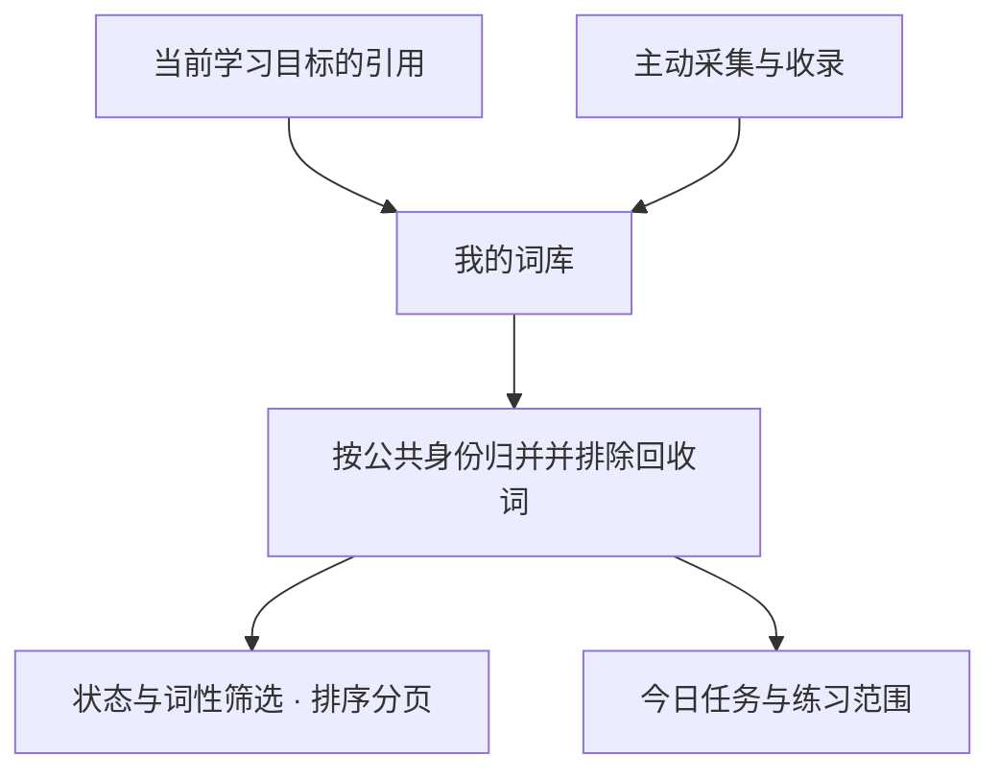

<!-- /leximeet-diagram -->

用户把某个目标词移到回收站后，它从我的词库、目标任务与新的练习队列中排除。公共词典仍可查到该词。恢复后重新参与当前目标；纯目标引用不会被误记为一次采集，也不会凭空增加语境或分数。

更换目标时，未主动收录的旧目标引用不再显示；用户已有笔记、主动收录与单词本中的词不因换目标被删除。

## 筛选、排序与多选

状态 Tab 在全量范围上筛选；词性、搜索和排序可以组合。词性来自 Dictionary 的真实义项，一个词可以同时属于名词与动词。词典中的来源频次排名不是统一“重要等级”，界面不显示猜测的等级。

| 操作       | 含义                                                       |
| ---------- | ---------------------------------------------------------- |
| 最近更新   | 有个人更新的词优先；没有个人时间的目标引用按目标原顺序排列 |
| 字母排序   | 按归一词头排列，大小写不分成不同单词                       |
| 词书顺序   | 使用当前目标的来源顺序                                     |
| 词性筛选   | 任一义项符合所选词性即可；在分页之前过滤                   |
| 当前页全选 | 只选眼前这一页，最多 40 词，不暗中选中其他页               |

改变搜索、词性、状态、排序或页码会清空选择。刷新保留仍在当前页的选择，过期查询不能覆盖新页。插件导航定位单词时会解除阻碍该词出现的词性筛选。

选中后可点「放入单词本」，同时选择多个单词本，追加归类并保留原有关系。将目标引用加入个人单词本属于主动收录，不产生遇见或学习成绩。

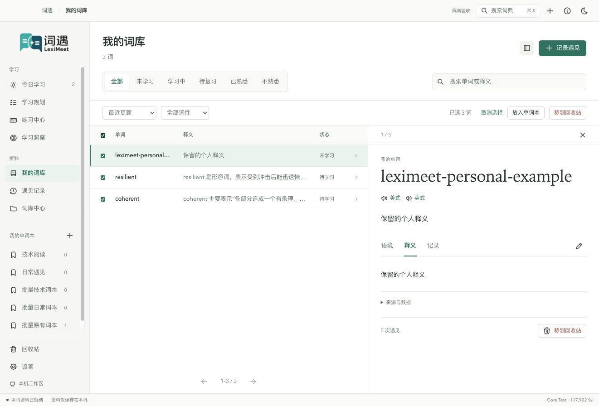

黑暗主题与窄窗多词本选择

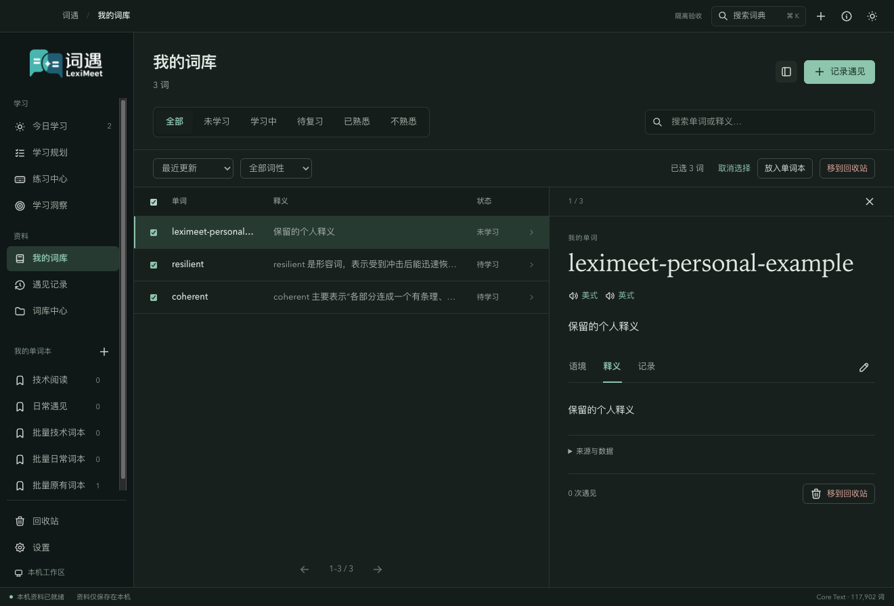

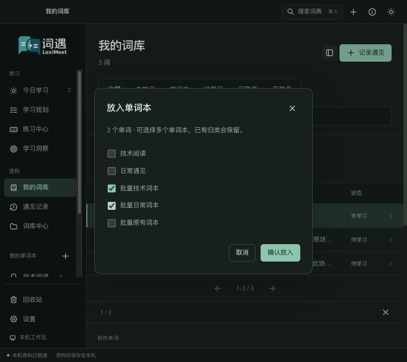

「移到回收站」是明确文字按钮。单词卡与批量操作都先显示确认对话框，取消不写入资料；确认后 Core 在同一事务中处理全部选中项。回收站支持逐词及批量恢复。恢复不会伪造采集记录，现有笔记与分数仍保留。

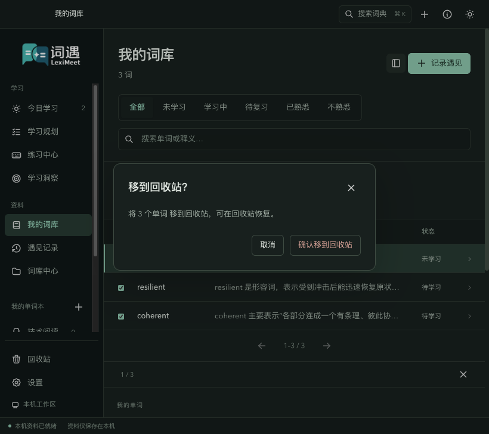

## 个人内容编辑

编辑面板只包含：

- **我的笔记**：保存个人理解、记忆方法或阅读备注。
- **加入单词本**：可同时属于多个个人单词本。

公共释义仍由词典提供。界面不支持编辑自定义释义或标签，也没有创建、删除标签的入口。正式个人领域只保存笔记和单词本归属。LMCP 词卡的个人内容与采集批注仅包含 `note`，旧个人释义和用户标签字段即使为空也拒绝；公共 Dictionary 资料保持只读。

个人编辑携带 `expectedRevision`。另一个窗口或插件修改了同一词时，保留输入并提示冲突。批量命令会按提交时的最新状态原子校验，再追加归类或改变回收标记，不覆盖笔记和隐藏字段；后续个人编辑会检测到这些修订变化。

## 预测面板表达什么

规划概览包含三项当前数据：目标已完成初学、待完成初学、按每日额度推算的天数。**初学完成是该词第一次达到 20 分**，不等于当前已熟悉，也不因后来扣分而重复计算。

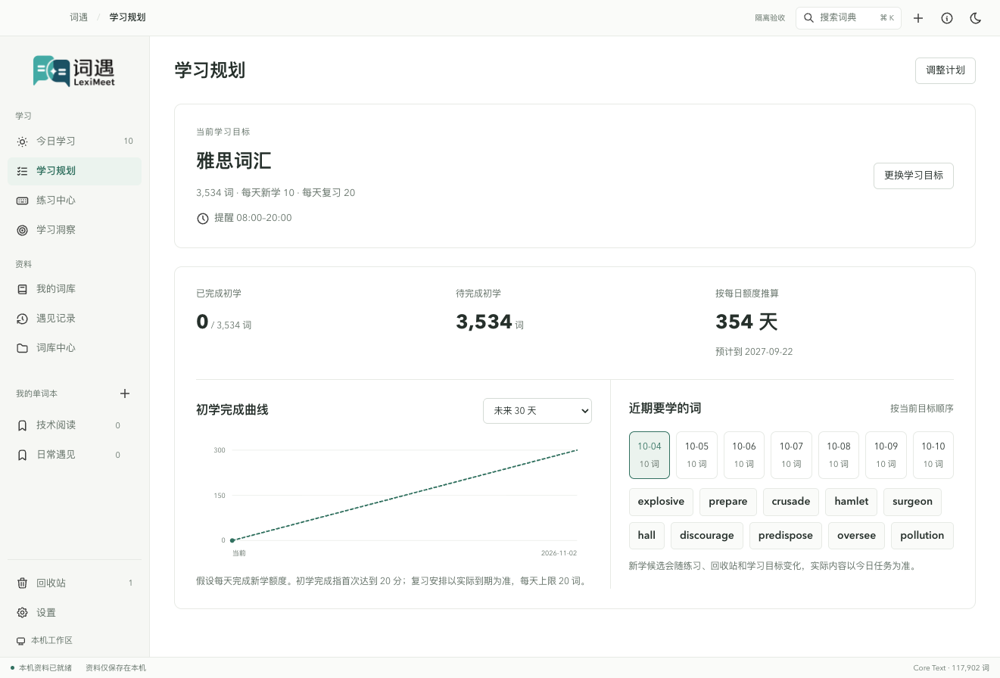

黑暗主题与改前概览

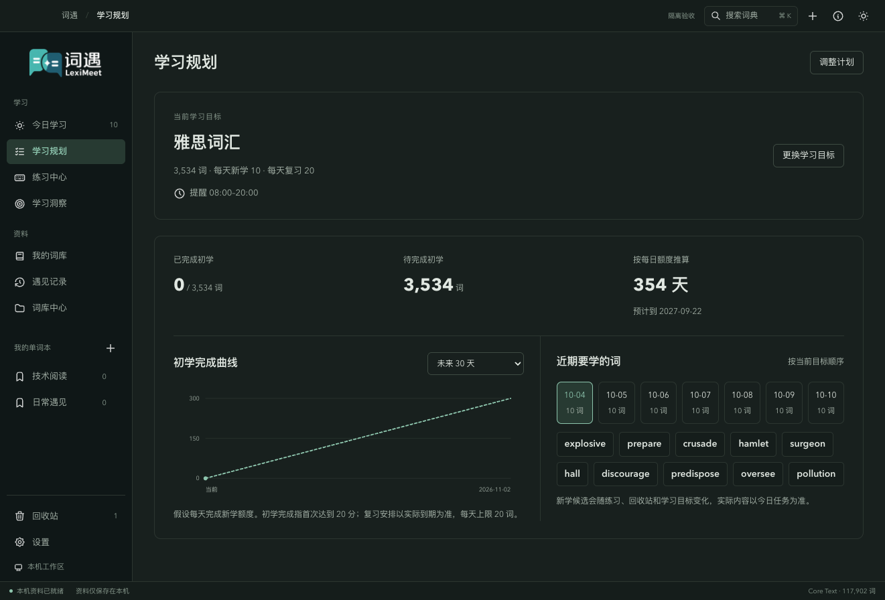

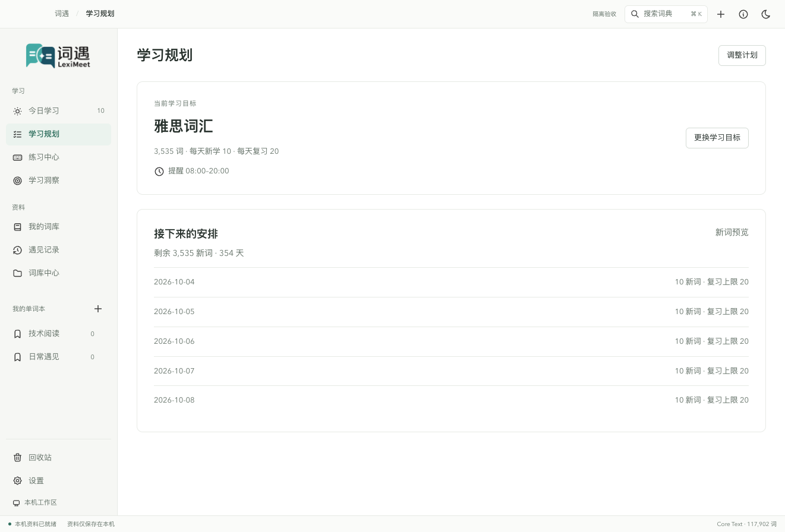

曲线可以选择 7 天、30 天、90 天或整个计划。实心点是当前完成量，虚线是额度推算；假设以后每天完成新学额度，数量不超过目标总量。今日先扣除已使用额度，并采用实际任务中的目标新学词。额外采集词可能占据今日任务，所以“当前目标今天没有新词安排”不代表今天不需要学习。

例如当前完成 100 词、剩余 65 词，每天新学 10，今天还能安排 5 个目标词：

| 时点       | 预计初学完成 |
| ---------- | ------------ |
| 当前       | 100          |
| 今天结束   | 105          |
| 明天结束   | 115          |
| 第七天结束 | 165          |

近期词表显示接下来最多七天的候选。今天和真实今日任务一致；未来按当前目标顺序预览，排除已初学完成、回收和今日已列出的词。悬停可看简短释义。候选会随着采集、练习、回收和目标变化而更新。

预测查询**不创建词、不计分、不生成 FSRS 卡，也不预发通知**。它不预测正确率、熟悉度衰减、未来复习到期或真实词汇量。每日复习额度仅显示为上限，具体复习以当天实际到期为准。

刷新时保留上一次图表，失败后显示错误和重试入口；更换目标时不沿用旧目标的图表。长计划最多绘制 121 个采样点，词表查询也限制范围，避免为了画图加载整本词典。

## 练习进度与整理的关系

六种练习在每个范围内分别保存游标、输入、提示状态和单词列表的完成项。例如临摹停在第 3 词、听音停在第 5 词，来回切换与应用重启仍分别恢复。积分与学习事实统一归属该词，不按模式复制六套分数。

「重新开始」只重开当前模式，刷新其范围以包含后来收录的词；其他模式保留自己的队列和进度。没有范围变化时复用词序，避免多存六份相同长列表。回收词会使相关练习范围重新计算，避免继续给被回收词出题。

听音、默写或填空使用提示后显示临摹式幽灵字母，真实输入保留，支持退格、方向键和输入法。提示不会把答案自动填进输入框；提示后的订正不再加分。

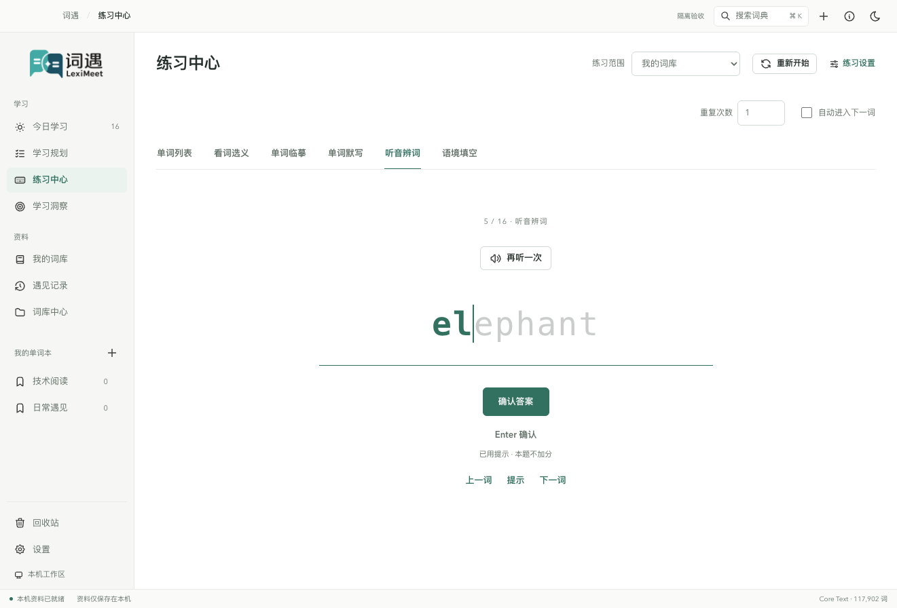

黑暗主题

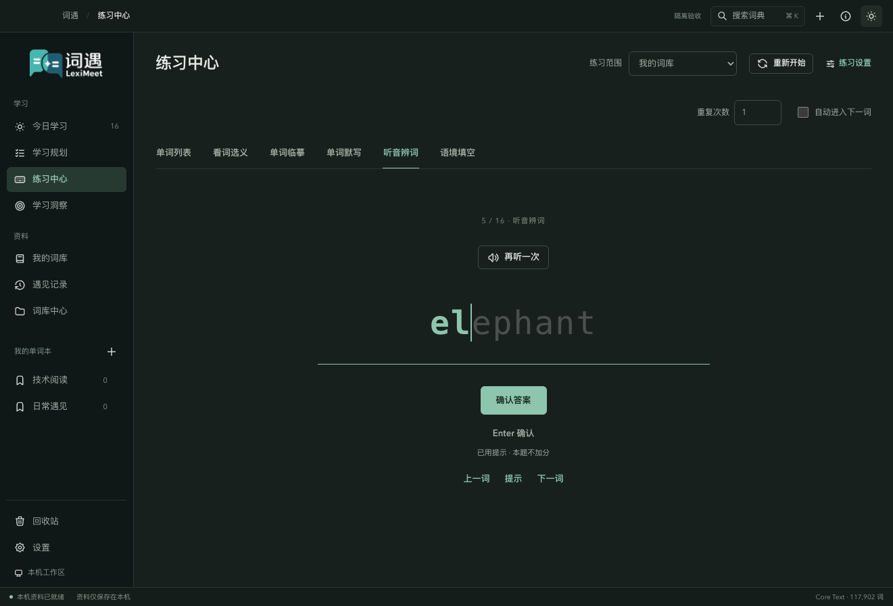

## 透明应用与通知图标

应用 PNG、macOS ICNS、Windows ICO 和通知图标统一使用透明的品牌符号，导出与透明像素验证见[品牌物料说明](../resources/brand/README.md)。下图左侧为实际素材对照；右侧为通知样式示意，系统真实排版、蒙版与应用身份仍由操作系统决定，开发模式可能显示 Electron 身份。

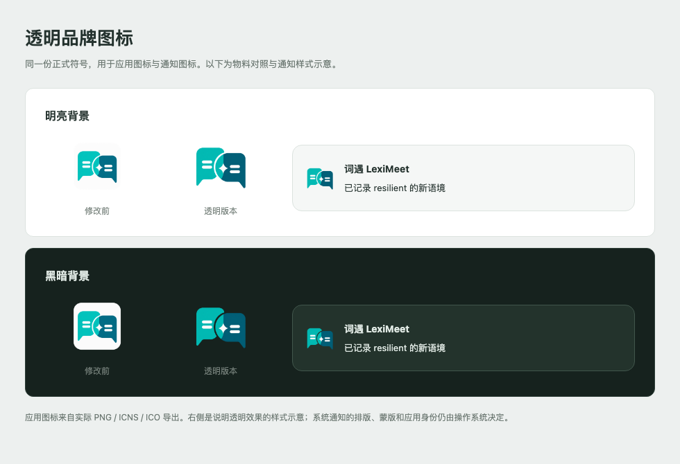

本页应用截图来自隐藏的真实 Electron / Main / Core 与隔离合成资料。改前和改后展示不同测试步骤，词数随回收和采集变化；旧截图用于对照界面，不能代表当前功能。原词库界面见下图，新增排序与批量操作位于当前列表上方。

词库改前

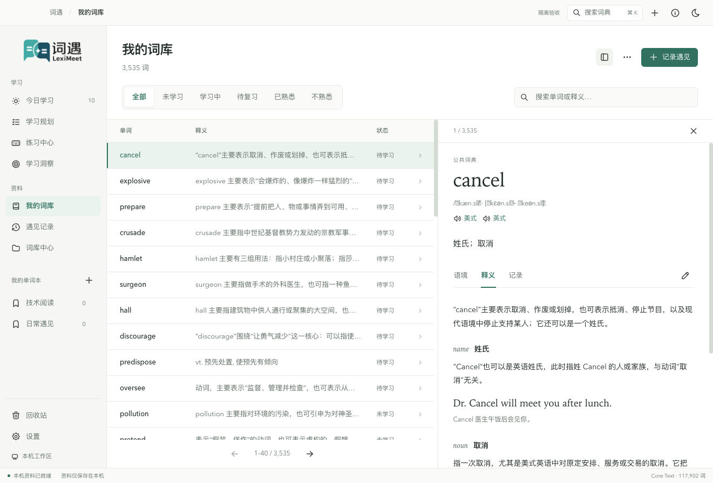

