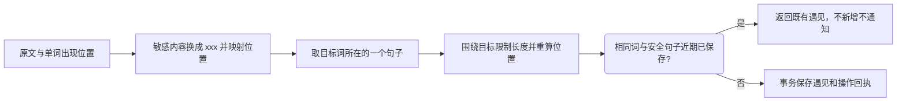

# 采集方式与语境

## 三个入口

| 入口       | 用途                           | 学习目标限制                             |
| ---------- | ------------------------------ | ---------------------------------------- |
| 系统剪贴板 | 复制阅读文本，为目标词积累语境 | 只处理当前目标内的英文词；没有目标不提醒 |
| 连接的插件 | 从网页等宿主增加单词和语境     | 不限定目标，保存到 Desktop               |
| 手动记录   | 主动添加额外单词和语境         | 不限定目标，可记录公共词典暂时没有的词   |

剪贴板识别默认关闭，可在「设置 → 采集与快捷键」开启。目标暂停计划后仍可采集语境。匹配英文词头时忽略大小写、统一撇号，但不把 running 自动当作 run，不把 URL/邮箱拆成单词候选；忽略密码管理器的 concealed / transient / autogenerated 格式。每次原文最多 20,000 字符、200 个候选，单词最长 120 字符。

## 句子、脱敏和重复

三种入口共用设置。默认开启脱敏、重复窗口 7 天、语境最多 500 个 UTF-16 单元。设置可关闭脱敏/去重；重复窗口允许 0–365 天（0 为关闭），语境限长允许 120–2000。设置页提供常用窗口选项。

<!-- leximeet-diagram: figure-e34834487d-01 -->
<picture>
  <source media="(prefers-color-scheme: dark)" srcset="diagrams/rendered/figure-e34834487d-01.dark.svg">
  
</picture>

查看和编辑 Mermaid 源码

[图源文件](diagrams/figure-e34834487d-01.mmd)

<!-- /leximeet-diagram -->

例如复制 `Today is sunny. An apple arrived; email me at reader@example.test. Tomorrow we leave.`，先把邮箱换成 xxx，再为 apple 保存它所在的句子；前后两个无关句子不进入该词语境。先脱敏可避免把邮箱或令牌内的标点误当作句号。超过上限的长句围绕目标裁剪，不能裁掉目标后继续保存无效出现位置；目标本身落在敏感内容内则拒绝采集。

同一词从剪贴板、插件或手动再次保存相同安全句子，只要落在重复窗口内，返回既有记录，不增加遇见次数，不触发采集完成教学或成功通知；不同句子仍可采集。去重使用稳定词身份与安全文本，不能把同拼写的不同公共词条混为一词。安全句子先 NFC 规范化，再合并 Unicode White_Space 并按无关语言环境的小写生成查重键；原语境与真实位置保留，标点不同或句子内容不同仍可保存。窗口为滚动的七个 24 小时，包含精确七天边界；撤销记录不占窗口。规范化与窗口边界以 Core 的共享采集向量为准。请求重试的 eventId 幂等和七天语境去重分别处理，并发写入仍在事务中最终复核。

脱敏为明确规则，处理邮箱、手机号、证件号及带标签的密码/令牌等；它不能保证自动识别所有人名或商业秘密。关闭只影响后续记录，已替换的文字无法恢复。源标题、注释及网址按同一策略处理，记录与日志不额外保留未脱敏原文。字符串长度与位置使用跨端一致的 UTF-16 单位。

## 剪贴板提醒

Core 在通知前匹配目标、准备安全句子并过滤近期重复；正在等待决定的同一词同一句也只提示一次。保存时再次校验开关、目标成员、脱敏与重复窗口，不能只相信通知前的检查。

默认为每个词发送系统通知，用户可以立即采集、拒绝，或等待 10 秒。到时默认自动采集，也可设置为不采集。计时从系统投递回执开始；投递失败时不自动采集，也不隐式改用弹窗。明确选择「独立弹窗」后才使用弹窗，同样展示安全句子。切换/清除目标、停用识别或退出时，都会撤回待处理通知。

保存失败时保留原待处理项，系统通知或独立弹窗提供「重试采集」。重试使用同一个 operationId；Core 在同一事务内保存安全结果回执与遇见，响应丢失后仍能确认原结果，即使关闭七天去重也不会保存两次。operationId 用于可靠恢复一次操作，七天窗口用于不同操作之间的语境去重，两者分别处理。「关闭提示」只撤回这次提醒，不撤销可能已经保存的结果。

匹配或通知未送达时，可以在「设置 → 采集与快捷键」点击「重试采集」：只明确重新识别一次当前剪贴板，并重新展示原失败项的确认入口，后台轮询不会反复重写。系统仍无法送达时，这次明确点击才打开待处理窗口。复制正文完全相同，单靠轮询不能确认是否发生了新复制；不把同文本缓存清空后持续自动采集。目标变化、关闭识别或退出会撤回内存待处理项；Core 原操作回执持久保存，但本轮不提供退出后自动复原系统通知的功能。

剪贴板只增加语境，不把词改成手动收藏、不覆盖笔记或学习历史。更换目标后，旧目标仅有语境的词仍保留遇见记录；需要长期出现在个人词库可显式收藏。手动遇见快捷键打开独立编辑窗；重复时提示「此语境近期已记录」，可以修改句子再保存。

## 插件与桌面的归属

Browser 独立运行时使用自己的采集设置与事务。连接后使用 Desktop 的 capturePolicy，原独立资料/设置封存，不覆盖桌面规则。明确断开后恢复原资料；临时失联时不向原资料写入。公共词使用 Dictionary 0.0.3 entry ID，个人词使用 UUID；提取句子、脱敏、截断后，重新生成 occurrenceRanges。

插件保存成功后，桌面默认发送「插件采集成功」系统通知，可单独关闭，不展示语境、网址或认证信息。真正新建的遇见才发送；重复语境、失败请求、同事件重试均不重复通知。关闭期间不补发，通知失败也不撤销已保存资料。

本机入口为 clipboardCandidates、captureClipboard、capture；对外使用 recordEncounter。getWorkspace 附带 capturePolicy，recordEncounter 附带 captureStatus：created / duplicate-context；重复仍返回既有 EncounterRecordRead。它们使用固定 LMCP 1.0.0 的安全附加字段规则，不改变冻结规范。当前 schema100 不增加 0.x 测试资料迁移；正式 1.0.0 发布后的兼容另行维护。

自动化测试覆盖安全句子、范围、长度、同词跨来源去重、窗口边界、并发与回执、资料归属端的设置和通知链；系统横幅与权限仍需人工验收。使用方法见[本地测试启动](本地测试启动.md)，核心测试见[日常使用与升级测试](日常使用与升级测试.md)。
